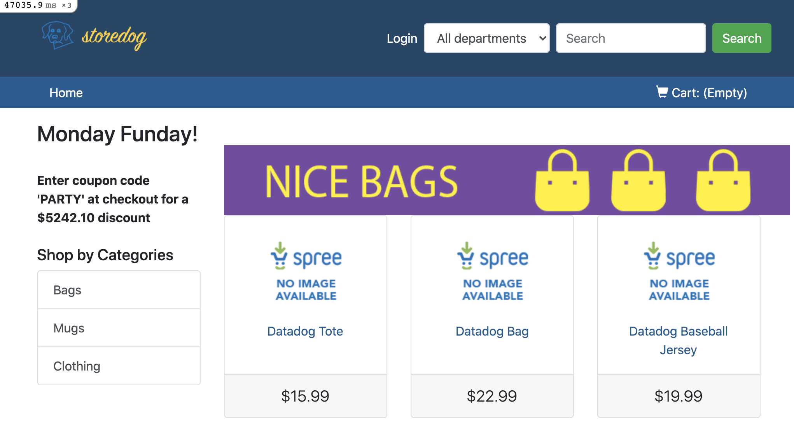
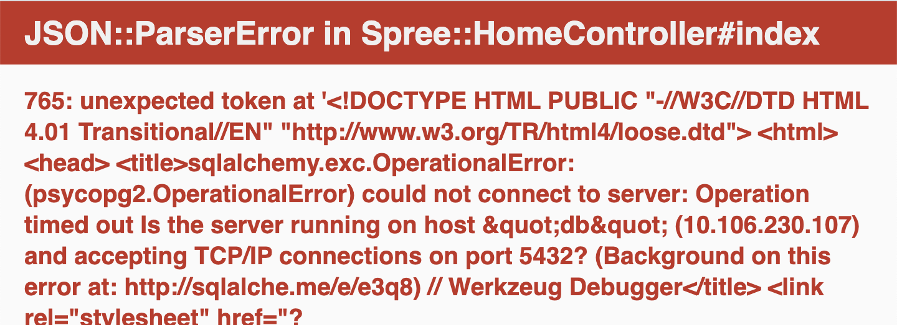

Wait some minutes until your environment is setup. Once it is setup, you will see the following message in your terminal:`OK, the training environment is installed and ready to go.`

Once the environment is ready, the ecommerce application will already be provisioned for you. You can check the different deployments that are part of the application by running the following command: `kubectl get deployment --selector=app=ecommerce`{{execute}} 

You should get output similar to this:

```
NAME             DESIRED   CURRENT   UP-TO-DATE   AVAILABLE   AGE
advertisements   1         1         1            1           4m
db               1         1         1            1           4m
discounts        1         1         1            1           4m
frontend         1         1         1            1           3m
```

The ecommerce application consists of a big monolith application called `frontend`, a microservice that serves advertisements, a microservice that serves discounts coupons and a postgres database.

Check that all the pods are running correctly by running the following command: `kubectl get pods --selector=app=ecommerce`{{execute}}

At this point you can visit the ecommerce application by clicking on the Ecommerce App tab in the terminal. Browse around to familiarize yourself with the application. Can you tell what areas of web page are served by the `advertisements` and `discounts` microservices?



Note: if you get an error like the one shown below, please refresh the page. It happens when the database is still initializing:


