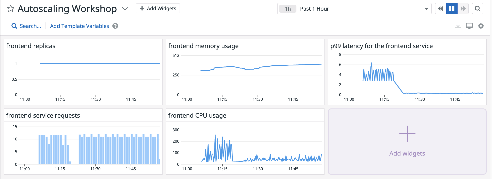

We are going to build a dashboard in Datadog that will help us visualize what is happening in our cluster throughout the rest of the workshop.

Click on Dashboards -> New Dashboard in the menu. Provide a name and select New Dashboard (on the left):

Click on "Add Widget" and select "Timeseries" as the type of widget.

For the first graph we are going to visualize the number of pod replicas we have for the `store-frontend` service. Select `kubernetes_state.deployment.replicas` as metric and filter by `kube_deployment:frontend`. Title it as "frontend replicas":

Save the widget and add another "Timeseries" widget to the dashboard. This time select `kubernetes.cpu.usage.total` as metric and `kube_deployment:frontend` as filter. Title it as "frontend CPU usage".

Save the widget and add another "Timeseries" widget to the dashboard. This time select `kubernetes.memory.usage` as metric and `kube_deployment:frontend` as filter. Title it as "frontend memory usage".

Save the widget and add another "Timeseries" widget to the dashboard. This time select `trace.rack.request` as metric and `service:store-frontend` as filter, and select the p99 metric. Title it as "p99 latency for the frontend service".

Save the widget and add another "Timeseries" widget to the dashboard. This time select `trace.rack.request.hits` as metric and `service:store-frontend` as filter. Title it "frontend service requests". Save this widget and click on "Close" to save the full Dashboard. You should get a Dashboard similar to this:

You can reference [Datadog's documentation on Dashboards](https://docs.datadoghq.com/dashboards/).