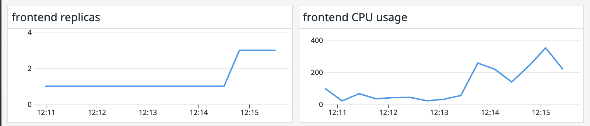

Horizontal Pod Autoscaling based on resource data will allow us to automatically increase or decrease the number of replicas of our Frontend service based on resource usage.

Open the `k8s-manifests/ecommerce-app/frontend.yaml`{{open}} file in the editor and check again the resources part of the specification:

```
resources:
  requests:
    cpu: 100m
    memory: 100Mi
```

Let's imagine that we want to keep the CPU resources to an average of 50% what we requested to the scheduler, so we know we have some spare CPU to handle peaks correctly.

We will create a [Horizontal Pod Autoscaler (HPA)](https://kubernetes.io/docs/tasks/run-application/horizontal-pod-autoscale/) object that will create new replicas when CPU usage goes above 50% of the 100m requested, sharing the load between those replicas.

We are going to create a new file called `frontend-hpa-cpu.yaml` (file creation happens automatically by clicking below on "Copy to Editor"):

<pre class="file" data-filename="frontend-hpa-cpu.yaml" data-target="replace">
apiVersion: autoscaling/v2beta2
kind: HorizontalPodAutoscaler
metadata:
  name: frontend-hpa-cpu
spec:
  minReplicas: 1
  maxReplicas: 3
  scaleTargetRef:
    apiVersion: apps/v1
    kind: Deployment
    name: frontend
  metrics:
  - type: Resource
    resource:
      name: cpu
      target:
        type: Utilization
        averageUtilization: 50
</pre>

Let's drilldown on each section to understand what's going on:

```
scaleTargetRef:
  apiVersion: apps/v1
  kind: Deployment
  name: frontend
```

In this section we are specifying the pods that will be the target for the horizontal scaling. In this case, we are specifying the pods that are part of the Deployment called `frontend`.

```
metrics:
- type: Resource
  resource:
    name: cpu
    target:
    type: Utilization
    averageUtilization: 50
```

In this section we are specifying the metric that the HPA will use to drive the scaling events. In this case we are telling the HPA that when pods that are part of the Deployment `frontend` are using on average more than 50% of their CPU request allocation (in our case 100m cores), create a scaling event that will increase the number of replicas.


```
minReplicas: 1
maxReplicas: 3
```

In this section of the specification we are specifiying the minimum and maximum number of replicas for the target that we want. In this case we are telling the HPA controller that, even if the replicas we have are consuming more than 50% of 100m cores on average, to not go above 3 replicas.

Create the HPA object by applying the manifest: `kubectl apply -f frontend-hpa-cpu.yaml`{{execute}}

You can check that it was created correctly by running the following command: `kubectl get hpa frontend-hpa-cpu`{{execute}} You should get an output similar to this one:

```
NAME               REFERENCE             TARGETS         MINPODS   MAXPODS   REPLICAS   AGE
frontend-hpa-cpu   Deployment/frontend   <unknown>/50%   1         3         1          29s
```

We are going to increase the traffic to our application to force the scaling event: `kubectl apply -f k8s-manifests/autoscaling/more-traffic.yaml`{{execute}}That manifest creates a pod that will send more regular traffic to our `frontend` Deployment.

After some seconds, this object will be updated with the CPU usage of the pods that are part of the `frontend` Deployment. Check it running the following command: `kubectl get hpa frontend-hpa-cpu -w`{{execute}} Have the number of replicas increased? Type `Ctrl+C` to return to the terminal once you are done.

```
NAME               REFERENCE             TARGETS   MINPODS   MAXPODS   REPLICAS   AGE
frontend-hpa-cpu   Deployment/frontend   102%/50%   1         3         2          45m
```

You can obtain more information about the different scaling events by describing the HPA object: `kubectl describe hpa frontend-hpa-cpu`{{execute}}

Navigate in Datadog to the Autoscaling Workshop dashboard you created in a previous step of this course. Can you see the the correlation between the increase in CPU usage and the increase in number of replicas?



Let's delete the extra traffic, the HPA and let's redeploy the `frontend` Deployment before doing the next exercise by executing: `kubectl delete -f k8s-manifests/autoscaling/more-traffic.yaml && kubectl delete -f frontend-hpa-cpu.yaml && kubectl delete -f k8s-manifests/ecommerce-app/frontend.yaml && kubectl apply -f k8s-manifests/ecommerce-app/frontend.yaml`{{execute}}
