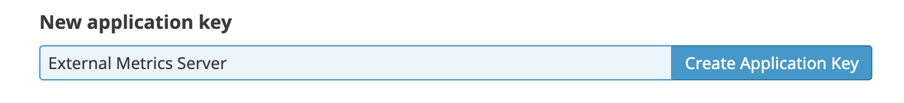

We will deploy now the [Datadog Cluster Agent that will work as External Metrics Server](https://docs.datadoghq.com/agent/cluster_agent/external_metrics/) for our scaling events.

First, we will create a secret with a random token that will be used to secure the communication between the cluster agent and the host agents. Create the secret with the token by running the following command: `kubectl create secret generic datadog-auth-token --from-literal=token=$(openssl rand -hex 16)`{{execute}}

Also, in order to be able to use the Cluster Agent as External Metrics Server, we need to retrieve the APP key (different from the API key) for our Datadog organization. To make things easier we have already injected your Datadog APP key in an environment variable. Check that it has a value by executing `echo $DD_APP_KEY`{{execute}}

<details>
<summary>If $DD_APP_KEY didn't have a value, click here for an alternative step</summary>

Log into [Datadog](https://app.datadoghq.com/) and navigate to the [API settings page](https://app.datadoghq.com/account/settings#api) to reveal your API key.

To do so, open the Datadog application and navigate to [Integrations -> APIs](https://app.datadoghq.com/account/settings#api). Click on Applications Keys and generate a new application key:



Once generated, export it as an environment variable:

`export DD_APP_KEY=<YOUR_DATADOG_APP_KEY>`{{copy}}
</details>

Create a new secret with the APP key by executing:

`kubectl create secret generic datadog-app-key --from-literal app-key=$DD_APP_KEY`{{execute}}

Check that the secret has been correctly created by running the following command: `kubectl get secret datadog-app-key`{{execute}} You should get output similar to the following:

```
NAME             TYPE      DATA      AGE
datadog-app-key   Opaque    1         8s
```

Before deploying the datadog cluster agent, we will delete the current Datadog agent DaemonSet, that we will redeploy later on with a different configuration: `kubectl delete daemonset datadog-agent`{{execute}}

To deploy the Datadog cluster agent, first we need to create the service account that will be used by the cluster agent and give it the right RBAC persmissions.

In the editor, open the file called `datadog/cluster-agent-rbac.yaml`{{open}} and browse it a bit. You can see that we are going to create a service account called `datadog-cluster-agent` and give it some permissions to the Kubernetes API through a ClusterRole and a ClusterRoleBinding. You can learn more about RBAC in [the official Kuberentes documentation](https://kubernetes.io/docs/reference/access-authn-authz/rbac/).

Create the service account, the ClusterRole and the ClusterRoleBinding by applying the `datadog/cluster-agent-rbac.yaml` manifest: `kubectl apply -f datadog/cluster-agent-rbac.yaml`{{execute}}

We will now deploy the Datadog Cluster Agent. Open the file called `datadog/datadog-cluster-agent.yaml`{{open}} in the editor and try to understand the different options that are set there. Can you spot which option enables the External Metrics Server for the HPA controller? Let's deploy it by executing `kubectl apply -f datadog/datadog-cluster-agent.yaml`{{execute}}

We will also need to give the Horizontal Pod Autoscaler some permissions to read the External Metrics Server. Give those permissions executing the following command: `kubectl apply -f datadog/hpa-rbac.yaml`{{execute}}

We will now deploy a slightly different version of the Datadog host agent. Open the file called `datadog/datadog-agent-with-cluster-agent.yaml`{{open}} and try to spot the differences. What are the differences between this manifest and the one we had deployed before? (`datadog/datadog-agent.yaml`). You can spot the differences running the following `diff` command: `diff -u datadog/datadog-agent.yaml datadog/datadog-agent-with-cluster-agent.yaml`{{execute}}

Let's deploy this new one by executing the following command: `kubectl apply -f datadog/datadog-agent-with-cluster-agent.yaml`{{execute}}

Wait until the Datadog agent is running by executing this command: `wait-datadog.sh`{{execute}}

Once the pod is running, let's check that the communication between the host agent and the cluster agent is working correctly. Execute the following command: `kubectl exec -ti ds/datadog-agent -- agent status`{{execute}} With this command we are executing the status command for the Datadog agent on the first container of the main pod for the DaemonSet `datadog-agent`. If the agent host is correctly communicating with the cluster agent, at the botton of the output from running that command you should get something similar to this:

```
=====================
Datadog Cluster Agent
=====================

  - Datadog Cluster Agent endpoint detected: https://10.106.157.238:5005
  Successfully connected to the Datadog Cluster Agent.
  - Running: 1.7.0+commit.4568d4d
```
