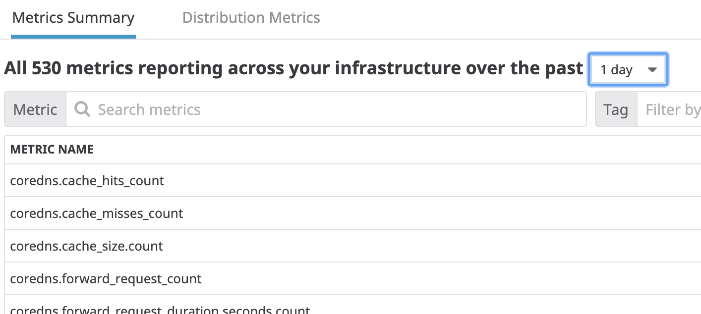
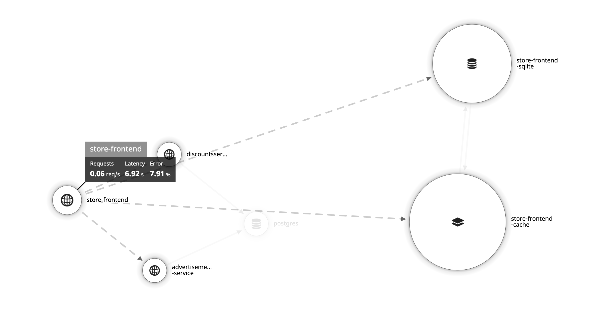
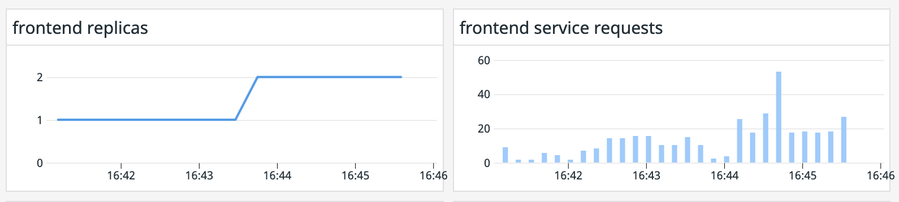

We have set up our Datadog Cluster Agent to also work as a HPA External Metrics server. That means that we can drive our scaling events based on any metric we have in our Datadog account.

Let's check what metrics do we have available by navigating to the [Metrics Summary in Datadog](https://app.datadoghq.com/metric/summary). Spend a bit of time checking the different metrics that we have available and try to understand what some of those are tracking. TIP: Clicking on any available metric in the Metrics Summary will show a description of the metric and the available tags for that metric.



As we discussed, the LETS (Latency, Errors, Traffic, Saturation) framework is a good place to start when we want to start tracking our application. We will scale our application using the latency we are seeing in the `store-frontend` service. Right now, our application is getting regular traffic coming from the deployment called `regular-traffic`. What latency is the service `store-frontend` experiencing? To answer that question we can navigate to the [Service Map](https://app.datadoghq.com/apm/map?env=ruby-shop) in Datadog and hover over the `store-frontend` service. What latency are we seeing?



We are experiencing a latency of around 7 seconds and we don't want it to grow a lot when the traffic increases. For that, we are going to create a HPA object that uses the `trace.rack.request.duration.by.service.99p` and that will have 7 seconds as the limit to start scaling our deployment.

We are going to create a new file called `frontend-hpa-latency.yaml` (file creation happens automatically by clicking below on "Copy to Editor"):

<pre class="file" data-filename="frontend-hpa-latency.yaml" data-target="replace">
apiVersion: autoscaling/v2beta2
kind: HorizontalPodAutoscaler
metadata:
  name: frontendhpaduration
spec:
  minReplicas: 1
  maxReplicas: 3
  scaleTargetRef:
    apiVersion: apps/v1
    kind: Deployment
    name: frontend
  metrics:
  - type: External
    external:
      metric:
        name: "trace.rack.request.duration.by.service.99p"
        selector:
          matchLabels:
            service: store-frontend
      target:
        type: AverageValue
        averageValue: 7
</pre>

Let's drilldown on each section to understand what's going on:

```
scaleTargetRef:
  apiVersion: apps/v1
  kind: Deployment
  name: frontend
```

In this section we are specifying the pods that will be the target for the horizontal scaling. In this case, we are specifying the pods that are part of the Deployment called `frontend`.

```
  metrics:
  - type: External
    external:
      metric:
        name: "trace.rack.request.duration.by.service.99p"
        selector:
          matchLabels:
            service: store-frontend
      target:
        type: AverageValue
        averageValue: 7

```

In this section we are specifying the metric that the HPA will use to drive the scaling events. In this case we are telling the HPA that when pods that are part of the Deployment `frontend` experience an average p99 latency over 7 seconds, create a scaling event that will increase the number of replicas.


```
minReplicas: 1
maxReplicas: 3
```

In this section of the specification we are specifiying the minimum and maximum number of replicas for the target that we want. In this case we are telling the HPA controller that, even if the replicas are experiencing over 7 seconds of p99 latency, to not go above 3 replicas.

Create the HPA object by applying the manifest: `kubectl apply -f frontend-hpa-latency.yaml`{{execute}}

Let's check that the object has been created correctly. Execute the following command: `kubectl get hpa frontendhpaduration`{{execute}} You should get an output similar to this:

```
NAME                  REFERENCE             TARGETS          MINPODS   MAXPODS   REPLICAS   AGE
frontendhpaduration   Deployment/frontend   <unknown>/7 (avg)   1         3         1        5s
```

On that output we can check the current value of the metric, the threshold for the scaling events, and the current number of replicas. If you are getting an `<unknown>` value for the current value of the metric is because it was just created and it hasn't got a metric value yet.

Let's check that the Datadog Cluster Agent is now taking care of that HPA object. Execute the following command: `kubectl describe hpa frontendhpaduration`{{execute}} and make sure that you get the following object event: 

```
Events:
  Type     Reason                                         Age   From                       Message
  ----     ------                                         ----  ----                       -------
  Normal   Autoscaler is now handle by the Cluster-Agent  23s   datadog-cluster-agent
```

Finally, let's check that the Cluster Agent is getting the metric correctly by executing the agent status for the Cluster Agent: `kubectl exec -ti $(kubectl get pods -l app=datadog-cluster-agent -o jsonpath='{.items[0].metadata.name}') -- agent status | grep -A11 "External Metrics"`{{execute}} Browse the output and check that you get an output similar to this one (you may need to run the command several times until we get the metric value from Datadog):

```
External Metrics
----------------
  Total: 1
  Valid: 1

* horizontal pod autoscaler: default/frontendhpaduration
  Metric name: trace.rack.request.duration.by.service.99p
  Labels:
  - service: store-frontend
  Value: 6.224347114562988
  Timestamp: 2020-04-01 08:06:30.000000 UTC
  Valid: true
```

That states that the Cluster Agent is correctly getting the value of the metric requested by our HPA object. Let's get the HPA object again to see if the metric is being reflected there. Execute the following command: `kubectl get hpa frontendhpaduration`{{execute}}:

```
NAME                  REFERENCE             TARGETS          MINPODS   MAXPODS   REPLICAS   AGE
frontendhpaduration   Deployment/frontend   6099m/7 (avg)   1         3         1          33m
```

Let's generate some more fake traffic to force the p99 latency to go beyond 7 seconds. Execute the following command: `kubectl apply -f k8s-manifests/autoscaling/spike-traffic.yaml`{{execute}}

Let's watch the HPA object to check when something changes: `kubectl get hpa frontendhpaduration -w`{{execute}}. Wait some minutes to see the replicas number going up. Once you are done watching the object, type `Ctrl+C` to go back to the terminal.

Did the deployment scale? Navigate in Datadog to the Autoscaling Workshop dashboard you created in a previous step of this course. Can you see the the correlation between the increase in the p99 latency and the increase in number of replicas?



You can obtain more information about the different scaling events that happened by describing the HPA object: `kubectl describe hpa frontendhpaduration`{{execute}}

Before moving to the next step, let's clean up our HPA and let's redeploy the Ecommerce application, so we go back to 1 replica. Execute the following command: `kubectl delete -f k8s-manifests/autoscaling/spike-traffic.yaml && kubectl delete hpa frontendhpaduration && kubectl apply -f k8s-manifests/ecommerce-app`{{execute}}
