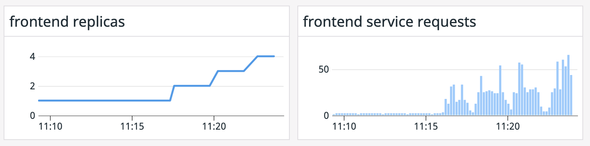

In order to be able to deploy Watermark Pod Autoscaler objects (WPAs) we first need to deploy the Custom Resource Definition and the controller, as these are not part of a default Kubernetes distribution.

Let's create the CRDs first. Execute the following command: `kubectl apply -f k8s-manifests/watermarkpodautoscaler/crd/`{{execute}} This will create a new WatermarkPodAutoscaler object in the Kubernetes API. Let's check that the object type is now available by running the following command: `kubectl get wpa`{{execute}} You shouldn't get an error and you should get the following output:

```
No resources found in default namespace.
```

Note: you may need to rerun the command to take effect: `kubectl get wpa`{{execute}}

Let's apply now the manifests that deploy the WPA controller. This controller will watch for new WPA objects created and create scaling events based on the metrics. Execute the following command: `kubectl apply -f k8s-manifests/watermarkpodautoscaler/`{{execute}}

Check that the `watermarkpodautoscaler` is running correctly: `kubectl get pod $(kubectl get pods -l name=watermarkpodautoscaler -o jsonpath='{.items[0].metadata.name}')`{{execute}}

Now, we will need to edit the Cluster Agent manifest to enable working with WPA objects. Open the file called `datadog/datadog-cluster-agent.yaml`{{open}} with the editor and find the following section:

```
- name: DD_EXTERNAL_METRICS_PROVIDER_WPA_CONTROLLER
  value: 'false'
```

Edit the value to `true` and re-apply the manifest by executing `kubectl apply -f datadog/datadog-cluster-agent.yaml`{{execute}}

Similar to the HPA example, we will create a WPA object that will scale our `frontend` deployment based on the p99 latency that the service experiences.

We are going to create a new file called `frontend-wpa.yaml` (file creation happens automatically by clicking below on "Copy to Editor"):

<pre class="file" data-filename="frontend-wpa.yaml" data-target="replace">
apiVersion: datadoghq.com/v1alpha1
kind: WatermarkPodAutoscaler
metadata:
  name: frontend-wpa-latency
spec:
  downscaleForbiddenWindowSeconds: 60
  upscaleForbiddenWindowSeconds: 30
  minReplicas: 1
  maxReplicas: 5
  scaleTargetRef:
    kind: Deployment
    apiVersion: apps/v1
    name: frontend
  metrics:
  - external:
      highWatermark: "7"
      lowWatermark: "4"
      metricName: "trace.rack.request.duration.by.service.99p"
      metricSelector:
        matchLabels:
          service: store-frontend
    type: External
  tolerance: 0.01
</pre>

Create the WPA object by applying the manifest: `kubectl apply -f frontend-wpa.yaml`{{execute}}

Let's drilldown on each section to understand what's going on:

```
scaleTargetRef:
  apiVersion: apps/v1
  kind: Deployment
  name: frontend
```

In this section we are specifying the pods that will be the target for the horizontal scaling. In this case, we are specifying the pods that are part of the Deployment called `frontend`.

```
metrics:
- external:
    highWatermark: "7"
    lowWatermark: "4"
    metricName: "trace.rack.request.duration.by.service.99p"
    metricSelector:
    matchLabels:
        service: store-frontend
  type: External
```

In this section we are specifying the metric that the WPA will use to drive the scaling events. In this case we are telling the WPA that when pods that are part of the Deployment `frontend` experience an average p99 latency over 7 seconds, to create a scaling event that will increase the number of replicas, but, once the p99 latency starts going down, to not scale down the deployment until the p99 latency is less than 4 seconds.

```
minReplicas: 1
maxReplicas: 5
```

In this section of the specification we are specifiying the minimum and maximum number of replicas for the target that we want. In this case we are telling the WPA controller that, even if the replicas are experiencing over 7 seconds of p99 latency, to not go above 5 replicas.

Other options in our manifest:

 * `downscaleForbiddenWindowSeconds: 60`: Wait 60 seconds after a scaling event before scaling down
 * `upscaleForbiddenWindowSeconds: 30`: Wait 30 seconds after a scaling event before scaling up

Let's check that the Cluster Agent is getting the metric correctly by executing the agent status for the Cluster Agent: `kubectl exec -ti $(kubectl get pods -l app=datadog-cluster-agent -o jsonpath='{.items[0].metadata.name}') -- agent status | grep -A11 "External Metrics"`{{execute}} Browse the output and check that you get an output similar to this one:

```
External Metrics
----------------
  Total: 1
  Valid: 1

* watermark pod autoscaler: default/frontend-wpa-latency
  Metric name: trace.rack.request.duration.by.service.99p
  Labels:
  - service: store-frontend
  Value: 6.563013076782227
  Timestamp: 2020-04-21 14:46:30.000000 UTC
  Valid: true
```

This may take some time, until we have a metric value. Keep running the latest command until you get the metric value correctly.

That states that the Cluster Agent is correctly getting the value of the metric requested by our WPA object. Let's get the WPA object again to see if the metric is being reflected there. Execute the following command: `kubectl get wpa frontend-wpa-latency`{{execute}}:

```
NAME                   VALUE    HIGH WATERMARK   LOW WATERMARK   AGE   MIN REPLICAS   MAX REPLICAS   DRY-RUN
frontend-wpa-latency   65630m   7                4               11m   1              5
```

Let's generate more traffic to force the creation of several replicas. Create the traffic by applying the following manifest: `kubectl apply -f k8s-manifests/autoscaling/spike-traffic.yaml`{{execute}}

Let's watch the frontend pods to see if they increase: `kubectl get deployment frontend -w`{{execute}}. Remember to type `Ctrl+C` to go back to the terminal once you have seen the deployment scaling.

Did the deployment scale? Navigate in Datadog to the Autoscaling Workshop dashboard you created in a previous step of this course. Can you see the the correlation between the increase in the p99 latency and the increase in number of replicas? Did you find any differences on how the deployment scaled with the regular HPA and how it is scaling with the WPA? (Hint: you can see those steps related to scaling velocity, for example)



Remove the spike in traffic by executing: `kubectl delete -f k8s-manifests/autoscaling/spike-traffic.yaml`{{execute}}

Watch again the the frontend pods to see if they decrease: `kubectl get deployment frontend -w`{{execute}} Why aren't they decreasing? Tip: Check the metric value and our low watermark. Is the metric value below our low watermark to create the scaling down event?

You can obtain more information about the different scaling events that happened by describing the WPA object: `kubectl describe wpa frontend-wpa-latency`{{execute}}

For other WPA options and algorithm documentation you can check the [WPA documentation](https://github.com/DataDog/watermarkpodautoscaler).
