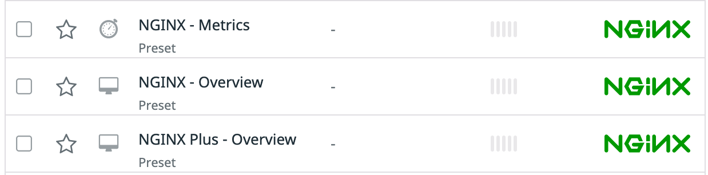

Now that we have our Datadog agent up and running we will create a NGINX Kubernetes deployment with 3 pods.

Open the file called `cluster-checks-files/nginx/nginx-deploy.yaml`{{open}} and check that we are going to create a regular 3 replicas NGINX deployment using a Docker image based on the `bitnami/nginx` image.

Create the deployment applying that YAML file:

`kubectl apply -f cluster-checks-files/nginx/nginx-deploy.yaml`{{execute}}

Let's check the workloads that have been deployed:

`kubectl get deployment nginx`{{execute}}

If we run again the agent status command, we see that the NGINX check is not running:

`kubectl exec -ti ds/datadog -- agent status`{{execute}}

We are going to annotate the deployment to enable the [NGINX integration](https://docs.datadoghq.com/integrations/nginx/?tab=host). To learn how to annotate Kubernetes deployments to enable integrations, you can refer to [the official documentation](https://docs.datadoghq.com/agent/kubernetes/integrations/?tab=kubernetes).

We have prepared a file with the right annotations. Open the file `cluster-checks-files/nginx/nginx-deploy-annotations.yaml`{{open}} and check the annotations to enable the NGINX check.

You can check the difference between both deployments running this command: `diff cluster-checks-files/nginx/nginx-deploy.yaml cluster-checks-files/nginx-deploy-annotations.yaml`{{execute}}

Lets apply those changes:

`kubectl apply -f cluster-checks-files/nginx/nginx-deploy-annotations.yaml`{{execute}}

The NGINX deployment will perform a rolling update. You can watch the pods getting restarted executing this command: `kubectl get pods -l app=nginx -w`{{execute}}

Once the 3 pods have been restarted, type `Ctrl+C` to return to the terminal.

Let's run again the Datadog agent's status command to check that the NGINX check is now running correctly:

`kubectl exec -ti ds/datadog -- agent status`{{execute}}

You should get an output similar to this one:

```
nginx (3.8.0)
-------------
    Instance ID: nginx:6571c6caf6eba65b [OK]
    Configuration Source: kubelet:docker://0a294bbff91bfe5795cefeb050f9182b94f6cd91dab1647ebb5ea806e2e00aaf
    Total Runs: 16
    Metric Samples: Last Run: 7, Total: 112
    Events: Last Run: 0, Total: 0
    Service Checks: Last Run: 1, Total: 16
    Average Execution Time : 7ms
    Last Execution Date : 2021-02-03 14:15:41.000000 UTC
    Last Successful Execution Date : 2021-02-03 14:15:41.000000 UTC
    
    Instance ID: nginx:9ee71d5fb30fa502 [OK]
    Configuration Source: kubelet:docker://eeb3a0ecfeb11482ac0f386c23024d5f681fe79e1a3ad9b39ebfa5c59a775577
    Total Runs: 16
    Metric Samples: Last Run: 7, Total: 112
    Events: Last Run: 0, Total: 0
    Service Checks: Last Run: 1, Total: 16
    Average Execution Time : 5ms
    Last Execution Date : 2021-02-03 14:15:27.000000 UTC
    Last Successful Execution Date : 2021-02-03 14:15:27.000000 UTC
    
    Instance ID: nginx:aeb096133fec9b04 [OK]
    Configuration Source: kubelet:docker://5bd314c4acf735068817d8f760d4bc56c4bfa4fbdc72322168e22bea7f43f2fd
    Total Runs: 16
    Metric Samples: Last Run: 7, Total: 112
    Events: Last Run: 0, Total: 0
    Service Checks: Last Run: 1, Total: 16
    Average Execution Time : 6ms
    Last Execution Date : 2021-02-03 14:15:34.000000 UTC
    Last Successful Execution Date : 2021-02-03 14:15:34.000000 UTC
    
```

Navigate now to [Datadog Dashboard list](https://app.datadoghq.com/dashboard/lists). After some minutes the NGINX integration should have been enabled in the application and you should see the NGINX dashboards in the list of your dashboards:



Click on the NGINX - Overview dashboard. You should start seeing data coming from the NGINX annotated deployment:


