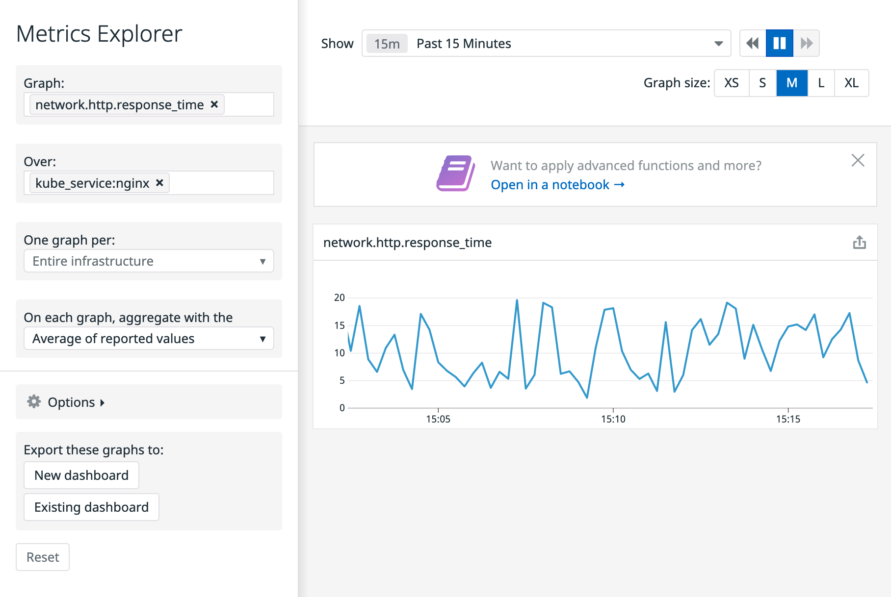

Now that we have the Cluster Agent (with cluster checks enabled) deployed in our cluster, let's enable the HTTP cluster check for our `nginx` Kubernetes service.

Right now, with the NGINX pod check, we are collecting metrics from the individual endpoints, but what if we want to get aggregated data (like aggregated latency) from the service that our users are going to be accessing (in our case, the `nginx` Kubernetes service). We can enable a check for a specific service using again Kubernetes annotations.

We are going to annotate the service to enable the [HTTP integration](https://docs.datadoghq.com/integrations/http_check/). To learn how to annotate Kubernetes service to enable integrations, you can refer to [the official documentation](https://docs.datadoghq.com/agent/cluster_agent/clusterchecks/#template-source-kubernetes-service-annotations).

We have prepared a file with the right annotations. Open the file `cluster-checks-files/nginx/nginx-service-annotations.yaml`{{open}} and check the annotations to enable the HTTP check in the Service definition.

You can check the difference between both deployments running this command: `diff -U6 cluster-checks-files/nginx/nginx-deploy-annotations.yaml cluster-checks-files/nginx/nginx-service-annotations.yaml`{{execute}}

Lets apply those changes:

`kubectl apply -f cluster-checks-files/nginx/nginx-service-annotations.yaml`{{execute}}

The annotations should have enabled the cluster check and the Cluster Agent should start dispatching the check to one of the node agents. We can check if this went well by running the `clusterchecks` command. The `clusterchecks` command will give the list of scheduled clusterchecks and it will report which worker node is running the check: `kubectl exec -ti deploy/datadog-cluster-agent -- agent configcheck`{{execute}}

You should get an output similar to this one:

```
=== 1 node-agents reporting ===

Name     Running checks
node01   1

===== Checks on node01 =====

=== http_check check ===
Configuration provider: kubernetes-services
Configuration source: kube_services:kube_service_uid://d2718dec-22a9-441e-bd05-e37dc068741d
Instance ID: http_check:My Nginx:30b88974d4440b2b
empty_default_hostname: true
name: My Nginx
tags:
- kube_cluster_name:katacoda
- kube_service:nginx
- kube_namespace:default
- cluster_name:katacoda
timeout: 1
url: http://10.107.133.131
~
Init Config:
{}
===
```

We can see that the HTTP check for our Kubernetes service `nginx` has been successfully dispatched to the node agent running on `node1` (easy, as it is the only node agent we have in our small cluster). Now that we know which node agent is running our check, we can see the check status running the `status` command in the corresponding node agent pod:

`kubectl exec -ti $(kubectl get pods -l app=datadog -o custom-columns=:.metadata.name --field-selector spec.nodeName=node01) -- agent status`{{execute}}

In the list of checks you should get something similar to the following:

```
http_check (4.9.0)
------------------
  Instance ID: http_check:My Nginx:30b88974d4440b2b [OK]
  Configuration Source: kube_services:kube_service_uid://d2718dec-22a9-441e-bd05-e37dc068741d
  Total Runs: 82
  Metric Samples: Last Run: 3, Total: 246
  Events: Last Run: 0, Total: 0
  Service Checks: Last Run: 1, Total: 82
  Average Execution Time : 14ms
  Last Execution Date : 2021-02-05 14:06:31.000000 UTC
  Last Successful Execution Date : 2021-02-05 14:06:31.000000 UTC
```

You should start seeing metrics in Datadog related to your service. Navigate to the [Metrics Explorer in the Datadog App](https://app.datadoghq.com/metric/explorer?exp_metric=network.http.response_time&exp_scope=kube_service%3Anginx&exp_agg=avg&exp_row_type=metric) to check the latency of our loadbalanced service.

