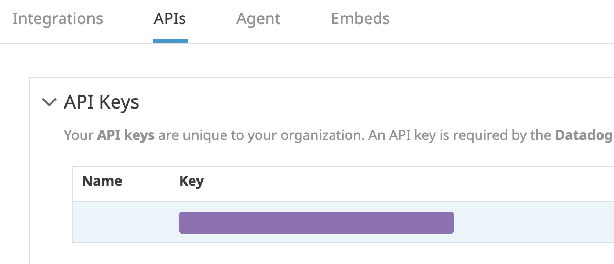

Wait some minutes until your environment is setup. Once it is setup, you will see the following message in your terminal:`OK, the training environment is installed and ready to go.`

Once the environment is ready, you can check the different cluster nodes and the Kubernetes version they are running by executing this command: `kubectl get nodes`{{execute}} 

The first thing we need to deploy the Datadog agent in our cluster is to retrieve the API key for our organization. If you don't currently have a Datadog account, or don't want to use your company's production environment, you can sign up for a [new Datadog trial account](https://www.datadoghq.com/free-datadog-trial/).

To retrieve the API key, log into [Datadog](https://app.datadoghq.com/) and navigate to the [API settings page](https://app.datadoghq.com/account/settings#api) to reveal your API key.

Export your API key in an environment variable:

`export DD_API_KEY=<YOUR_DATADOG_API_KEY>`{{copy}}

Check that your API key has been successfully exported by running this command: `echo $DD_API_KEY`{{execute}}. You should get the same value that you copied from the Datadog web application.
