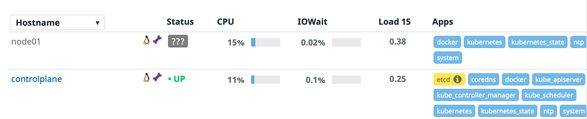

The first thing we are going to do is to deploy the Datadog Operator Helm chart enabling the DatadogMonitor feature and passing our Datadog account API and APP keys. Aside from those options, the Operator Helm chart will get deployed with the default `values.yaml` that comes with the chart. You can [check these default values in our Helm chart Github repository](https://github.com/DataDog/helm-charts/blob/master/charts/datadog-operator/values.yaml). We will also deploy the `kube-state-metrics` Helm chart, to get additional metrics from Kubernetes.

Let's deploy the charts:

`helm install my-datadog-operator datadog/datadog-operator --set apiKey="$DD_API_KEY" --set appKey="$DD_APP_KEY" --set datadogMonitor.enabled=true --version="0.6.0"`{{execute}}

`helm install ksm stable/kube-state-metrics --version="2.8.11"`{{execute}}

Let's check that the Datadog operator and the Kube State Metrics pods are running correctly by executing: `kubectl get pods`{{execute}} You should get an output similar to this one:

```
NAME                                      READY   STATUS    RESTARTS   AGE
ksm-kube-state-metrics-5f8944dfc9-t95nw   1/1     Running   0          18s
my-datadog-operator-7d59d55df7-nq8bb      1/1     Running   0          2m14s
```

The Datadog Operator Helm chart will also create a couple of Kubernetes secrets to store our Datadog's API and APP keys. Let's check the secrets by executing: `kubectl get secrets`{{execute}} You should get an output similar to this one:

```
NAME                                        TYPE                                  DATA   AGE
[...]
my-datadog-operator-apikey                  Opaque                                1      29m
my-datadog-operator-appkey                  Opaque                                1      29m
[...]
```

Once we have the operator up and running, we are ready to deploy the Datadog agent. Open the configuration we are going to apply and review it a bit `cluster-config-files/datadog-agent.yaml`{{open}}. Can you see the relation between the secret the Helm chart created and that configuration?

Let's apply it:

`kubectl apply -f cluster-config-files/datadog-agent.yaml`{{execute}}

We are creating a new type of Kubernetes object called `DatadogAgent`. Let's check it:

`kubectl get datadogagent`{{execute}}. You should get an output similar to this one:

```
NAME      ACTIVE   AGENT             CLUSTER-AGENT   CLUSTER-CHECKS-RUNNER   AGE
datadog   True     Running (2/2/2)                                           3m47s
```

(If you get an status of `Progressing` run again the command until the Datadog pod is running)

That object describes the intent of our Datadog deployment, and the operator creates the needed Kubernetes objects to match that intent. Let's check them:

`kubectl get daemonset`{{execute}}

```
NAME            DESIRED   CURRENT   READY   UP-TO-DATE   AVAILABLE   NODE SELECTOR   AGE
datadog-agent   2         2         2       2            2           <none>          8m3s
```

This is the Daemonset that deploys the Datadog node agent. To be able to gather information from the Kubelet and system metrics from each of the nodes, the Datadog node agent deploys at least 1 node agent pod per node. 

Let's also check the status of the Datadog agent on the worker node:

`kubectl exec -ti $(kubectl get pods -l agent.datadoghq.com/name=datadog -l agent.datadoghq.com/component=agent -o custom-columns=:.metadata.name --field-selector spec.nodeName=node01) -- agent status`{{execute}}

You can see the different checks that are running. The `kubelet` check will be one of the ones running, collecting your containers metrics:

```
[...]
kubelet (5.1.0)
---------------
Instance ID: kubelet:d884b5186b651429 [OK]
Configuration Source: file:/etc/datadog-agent/conf.d/kubelet.d/conf.yaml.default
Total Runs: 9
Metric Samples: Last Run: 243, Total: 2,181
Events: Last Run: 0, Total: 0
Service Checks: Last Run: 4, Total: 36
Average Execution Time : 180ms
Last Execution Date : 2021-01-20 13:55:32.000000 UTC
Last Successful Execution Date : 2021-01-20 13:55:32.000000 UTC
[...]
```

Open now the [Infrastructure List view in Datadog](https://app.datadoghq.com/infrastructure) and check that you are able to see both nodes (and their system metrics) in the list:

