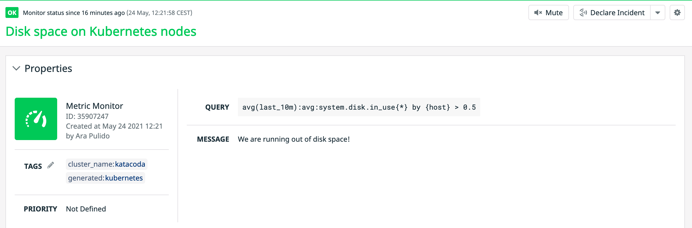

Now that we have the Datadog node and cluster agents running and collecting metrics, we want to use those metrics to generate alerts. We will start with our system metrics.

We have 2 hosts/nodes in our cluster, and we want to keep an eye to their disk usage to make sure that they don't fill up, as that would have an impact on the scheduling of pods that mount a host or an empty volume. We want to get alerted if the disk usage is over 50%.

Let's navigate to the [Notebook](https://app.datadoghq.com/notebook) section in Datadog to help us build the query we want to alert on:


Let's modify the metric to `system.disk.in_use` and let's group by `host`:


After clicking on `Done` you can copy the full query in your clipboard:


Open the configuration for the Datadog Monitor and review it a bit `cluster-config-files/datadog-monitor-disk.yaml`{{open}}. We are assigning a name to our monitor and a series of tags. We are missing the query, though. Edit the file with the query you copied from the notebook prepending `avg(last_10m):` (we want to alert when the condition happens for the past 10 minutes) and appending `> 0.5` to it, to alert when usage goes above 50%. The final file should look like this:

```
apiVersion: datadoghq.com/v1alpha1
kind: DatadogMonitor
metadata:
  name: disk-usage-nodes
spec:
  query: "avg(last_10m):avg:system.disk.in_use{*} by {host} > 0.5"
  type: "metric alert"
  name: "Disk space on Kubernetes nodes"
  message: "We are running out of disk space!"
  tags:
    - "cluster_name:katacoda"
```

Let's apply it:

`kubectl apply -f cluster-config-files/datadog-monitor-disk.yaml`{{execute}}

Once created, we can check the status of the monitor directly from the terminal by running `kubectl get datadogmonitor disk-usage-nodes`{{execute}}:

```
NAME               ID         MONITOR STATE   LAST TRANSITION        LAST SYNC              SYNC STATUS   AGE
disk-usage-nodes   35907247   OK              2021-05-24T10:22:33Z   2021-05-24T10:24:33Z   OK            3m10s
```

Navigating to [the monitors section in Datadog](https://app.datadoghq.com/monitors/manage) we can now see our new monitor:




We recommend always edit the monitor using the DatadogMonitor YAML definition and saving the changes to your Git repo before applying it to your cluster, instead of editing directly the monitor in the Datadog application, to follow GitOps principles.
