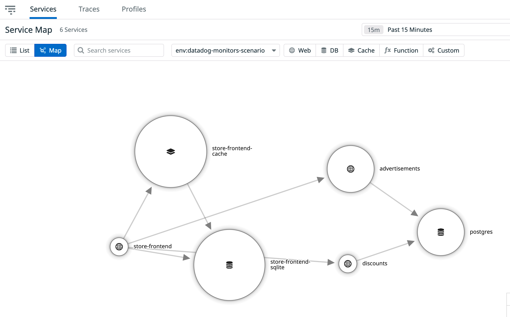
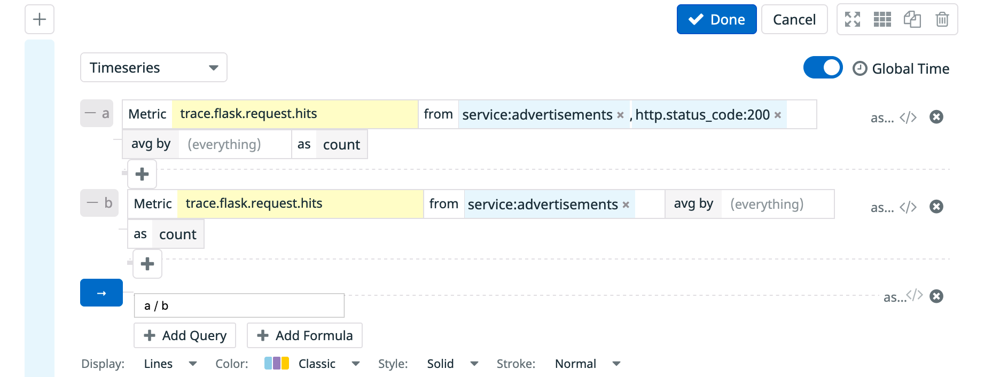
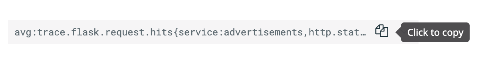
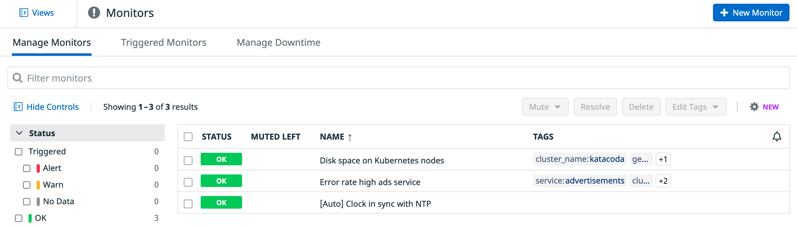
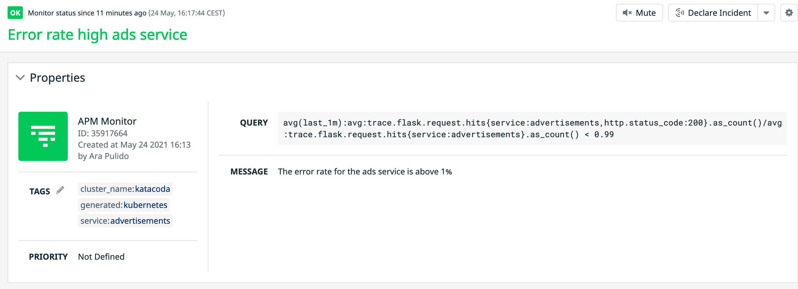

The other type of monitor that we are going to create is a monitor related to an application running in our cluster.

We have deployed an Ecommerce application in our cluster. Have a look to the pods that are part of the application by running this command: `kubectl get pods -l app=ecommerce`{{execute}}

The application is already instrumented for APM and as it has been sometime since we deployed the Datadog Agent and we are sending fake regular traffic to the application, navigating to [APM service map in Datadog](https://app.datadoghq.com/apm/map?env=datadog-monitors-scenario) should already show you a map similar to this one:



We want to create an alert for the Advertisements service when the error rate goes above 1% and we want to be able to store that monitor in Git alongside the rest of our application configuration.

Let's navigate again to the [Notebook](https://app.datadoghq.com/notebook) section in Datadog to help us build the query we want to alert on:


We are going to create a query for successful requests to the service, divided by total requests:



Once we click on `Done` we can copy the query:



Open the configuration for the Datadog Monitor and review it a bit `cluster-config-files/datadog-monitor-error-rate.yaml`{{open}}. We are assigning a name to our monitor and a series of tags. We are missing the query, though. Edit the file with the query you copied from the notebook prepending `avg(last_1m):` (we want to alert when the condition happens for the past minute) and appending `< 0.99` to it, to alert when error rate is above 1%. The final file should look like this:

```
apiVersion: datadoghq.com/v1alpha1
kind: DatadogMonitor
metadata:
  name: ads-error-rate 
spec:
  query: "avg(last_1m):avg:trace.flask.request.hits{service:advertisements,http.status_code:200}.as_count()/avg:trace.flask.request.hits{service:advertisements}.as_count() < 0.99"
  type: "metric alert"
  name: "Error rate high ads service"
  message: "The error rate for the ads service is above 1%"
  tags:
    - "cluster_name:katacoda"
    - "service:advertisements"
```

Let's apply it:

`kubectl apply -f cluster-config-files/datadog-monitor-error-rate.yaml`{{execute}}

Once created, we can check the status of the monitor directly from the terminal by running `kubectl get datadogmonitor ads-error-rate`{{execute}}:

```
NAME               ID         MONITOR STATE   LAST TRANSITION        LAST SYNC              SYNC STATUS   AGE
ads-error-rate     35917664   OK              2021-05-24T14:14:56Z   2021-05-24T14:15:56Z   OK            2m34s
```

Navigating to [the monitors section in Datadog](https://app.datadoghq.com/monitors/manage) we can now see our new monitor:




We recommend always edit the monitor using the DatadogMonitor YAML definition and saving the changes to your Git repo before applying it to your cluster, instead of editing directly the monitor in the Datadog application, to follow GitOps principles.
