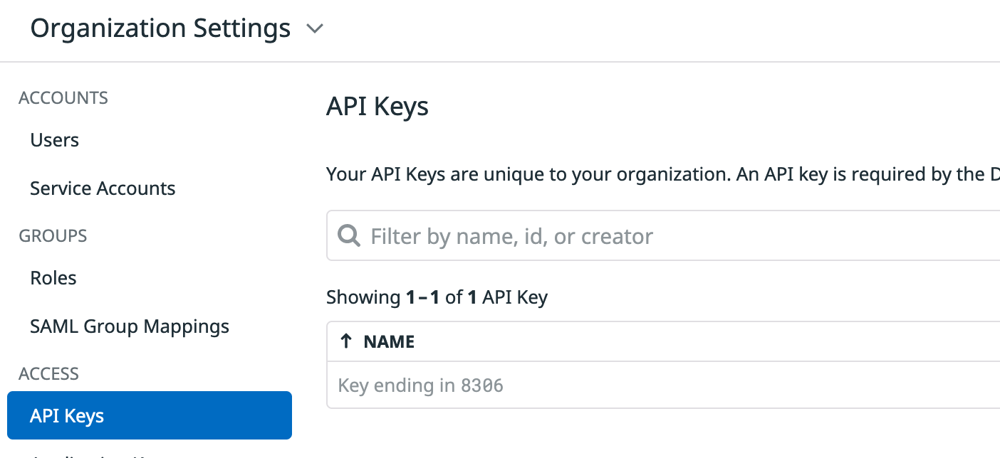

Wait some minutes until your environment is setup. Once it is setup, you will see the following message in your terminal:`OK, the training environment is installed and ready to go.`

Once the environment is ready, you can check the different cluster nodes and the Kubernetes version they are running by executing this command: `kubectl get nodes`{{execute}} 

```
NAME           STATUS   ROLES    AGE   VERSION
controlplane   Ready    master   17m   v1.19.4
node01         Ready    <none>   17m   v1.19.3
```

The first thing we need to deploy the Datadog agent in our cluster is to retrieve the API key and the APP key for our organization. If you don't currently have a Datadog account, or don't want to use your company's production environment, you can sign up for a [new Datadog trial account](https://www.datadoghq.com/free-datadog-trial/).

To retrieve the API key, log into [Datadog](https://app.datadoghq.com/) and navigate to the [Organization Settings -> API Keys](https://app.datadoghq.com/organization-settings/api-keys) page to reveal your API key.



Export your API key in an environment variable:

`export DD_API_KEY=<YOUR_DATADOG_API_KEY>`{{copy}}

Check that your API key has been successfully exported by running this command: `echo $DD_API_KEY`{{execute}}. You should get the same value that you copied from the Datadog web application.

To retrieve the App key, navigate to the [Organization Settings -> Application Keys](https://app.datadoghq.com/organization-settings/application-keys) page to reveal your App key.


Export your App key in an environment variable:

`export DD_APP_KEY=<YOUR_DATADOG_APP_KEY>`{{copy}}

Check that your App key has been successfully exported by running this command: `echo $DD_APP_KEY`{{execute}}. You should get the same value that you copied from the Datadog web application.
