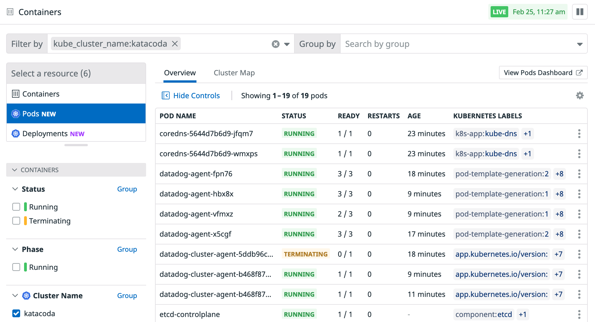

The first thing we are going to do is to deploy the Datadog Operator Helm chart without any additional options. When that happens, the Operator Helm chart will get deployed with the default `values.yaml` that comes with the chart. You can [check these default values in our Helm chart Github repository](https://github.com/DataDog/helm-charts/blob/master/charts/datadog-operator/values.yaml). We will also deploy the `kube-state-metrics` Helm chart, to get additional metrics from Kubernetes.

Let's deploy the charts:

`helm install my-datadog-operator datadog/datadog-operator --version="0.7.2"`{{execute}}

`helm install ksm stable/kube-state-metrics --version="2.8.11"`{{execute}}

Let's check that the Datadog operator and the Kube State Metrics pods are running correctly by executing: `kubectl get pods`{{execute}} You should get an output similar to this one:

```
NAME                                      READY   STATUS    RESTARTS   AGE
ksm-kube-state-metrics-5f8944dfc9-t95nw   1/1     Running   0          18s
my-datadog-operator-7d59d55df7-nq8bb      1/1     Running   0          2m14s
```

Once we have the operator up and running, we are ready to deploy the Datadog agent. First, we are going to create a Kubernetes secret to hold our Datadog API and App keys:

`kubectl create secret generic datadog-secret --from-literal api-key=$DD_API_KEY --from-literal app-key=$DD_APP_KEY`{{execute}}

Let's deploy now the Datadog node agent and cluster agent. Open the configuration we are going to apply and review it a bit `dd-operator-configs/datadog-agent-basic.yaml`{{open}}. Can you see the relation between the secret we just created and that configuration?

The [Datadog Node Agent](https://docs.datadoghq.com/agent/kubernetes/) will gather system metrics from all your Kubernetes nodes and will collect metrics, logs and traces from the containers running on each of the nodes.

The [Datadog Cluster Agent](https://docs.datadoghq.com/agent/cluster_agent/) provides a streamlined, centralized approach to collecting cluster level monitoring data. By acting as a proxy between the API server and node-based Agents, the Cluster Agent helps to alleviate server load. It also relays cluster level metadata to node-based Agents, allowing them to enrich the metadata of locally collected metrics.

The Cluster Agent is also required to enable the [Kubernetes resources view](https://docs.datadoghq.com/infrastructure/livecontainers/?tab=helm#kubernetes-resources-view) in the Live Containers page. We will enable that view in this step as well.

Let's apply the configuration:

`kubectl apply -f dd-operator-configs/datadog-agent-basic.yaml`{{execute}}

We are creating a new type of Kubernetes object called `DatadogAgent`. Let's check it:

`kubectl get datadogagent`{{execute}}. You should get an output similar to this one:

```
NAME      ACTIVE   AGENT             CLUSTER-AGENT   CLUSTER-CHECKS-RUNNER   AGE
datadog   True     Running (1/1/1)                                           3m47s
```

(If you get an status of `Progressing` run again the command until the Datadog pod is running)

That object describes the intent of our Datadog deployment, and the operator creates the needed Kubernetes objects to match that intent. Let's check them:

`kubectl get deploy datadog-cluster-agent`{{execute}}

```
NAME                    READY   UP-TO-DATE   AVAILABLE   AGE
datadog-cluster-agent   1/1     1            1           5m42s
```

This is the Deployment that deploys the Cluster Agent into our cluster.

`kubectl get daemonset`{{execute}}

```
NAME            DESIRED   CURRENT   READY   UP-TO-DATE   AVAILABLE   NODE SELECTOR   AGE
datadog-agent   1         1         1       1            1           <none>          8m3s
```

This is the Daemonset that deploys the Datadog node agent. To be able to gather information from the Kubelet and system metrics from each of the nodes, the Datadog node agent deploys at least 1 node agent pod per node. Let's check how many pods do we have after deploying the Daemonset and which nodes are they deployed to:

`kubectl get pods -l agent.datadoghq.com/name=datadog -l agent.datadoghq.com/component=agent -o custom-columns=NAME:.metadata.name,NODE:.spec.nodeName`{{execute}}

You should get an output similar to this one:

```
NAME                  NODE
datadog-agent-mhv58   node01
```

The Datadog node agent was deployed to the worker node, but not the control plane node. Why? There is a taint in the control plane node that prevents pods without the corresponding toleration being scheduled in that node:

`kubectl get nodes controlplane -o custom-columns=NAME:.metadata.name,TAINTS:.spec.taints`{{execute}}

You can read more about taints and tolerations in Kubernetes in [their official documentation](https://kubernetes.io/docs/concepts/scheduling-eviction/taint-and-toleration/).

If we want to monitor the control plane nodes, we will need to add a toleration for the control-plane nodes. We will explain how to do this in the next step.

Let's check the status of the Datadog agent:

`kubectl exec -ti ds/datadog-agent -- agent status`{{execute}}

Check the different checks that are running by default. You can see that the Kubelet check is failing. We will fix the configuration in a later step. As we discussed, the Node Agents need to communicate with the Cluster Agent to get metrics from the API server. We can check that this connection is happening correctly checking the "Datadog Cluster Agent" section of the output.

```
[...]
kubelet (5.1.0)
---------------
Instance ID: kubelet:d884b5186b651429 [ERROR]
Configuration Source: file:/etc/datadog-agent/conf.d/kubelet.d/conf.yaml.default
[...]
=====================
Datadog Cluster Agent
=====================

  - Datadog Cluster Agent endpoint detected: https://10.98.129.75:5005
  Successfully connected to the Datadog Cluster Agent.
  - Running: 1.15.0+commit.6781e85
```
Open now the [Live Containers view in Datadog](https://app.datadoghq.com/orchestration/overview/pod?cols=name%2Cstatus%2Cready%2Crestarts%2Cage%2Clabels&paused=false&sort=&tags=kube_cluster_name%3Akatacoda) to watch your Kubernetes objects directly from Datadog:


