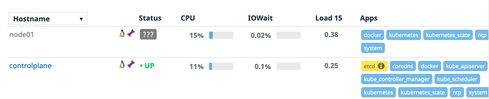

As we said, our cluster has two nodes, one worker and one control plane node, but the agent only deployed to the worker node. We are going to add a toleration to our `DatadogAgent` definition to match the control plane node.

Open the file called `dd-operator-configs/datadog-agent-tolerations.yaml`{{open}} and check how we have added a `config` section to the `agent` section to add the needed toleration:

```
[...]
    config:
      tolerations:
        - key: node-role.kubernetes.io/master
          effect: NoSchedule
```

You can check the differences between the previous `DatadogAgent` configuration file and this new one running the following command: `diff -U3 dd-operator-configs/datadog-agent-basic.yaml dd-operator-configs/datadog-agent-tolerations.yaml`{{execute}}

Let's apply this new object description:

`kubectl apply -f dd-operator-configs/datadog-agent-tolerations.yaml`{{execute}}

You can follow the update from the `DatadogAgent` object status (type `Ctrl+C` to return to the terminal once you can see the agents running and ready):

`kubectl get datadogagent -w`{{execute}}

```
controlplane $ kubectl get datadogagent -w
NAME      ACTIVE   AGENT              CLUSTER-AGENT   CLUSTER-CHECKS-RUNNER   AGE
datadog   True     Updating (2/1/1)                                           8m9s
datadog   True     Updating (2/1/1)                                           8m13s
datadog   True     Running (2/1/2)                                            8m43s
datadog   True     Running (2/2/2)                                            8m52s
```

Let's check now the number of pods we have for the Datadog agent and the nodes they are deployed to:

`kubectl get pods -l agent.datadoghq.com/name=datadog -l agent.datadoghq.com/component=agent -o custom-columns=NAME:.metadata.name,NODE:.spec.nodeName`{{execute}}

```
NAME                  NODE
datadog-agent-qglsd   controlplane
datadog-agent-vz26z   node01
```

We now have correctly one Datadog agent deployed to the control plane node.

Open now the [Infrastructure List view in Datadog](https://app.datadoghq.com/infrastructure) and check that you are able to see both nodes (and their system metrics) in the list:


