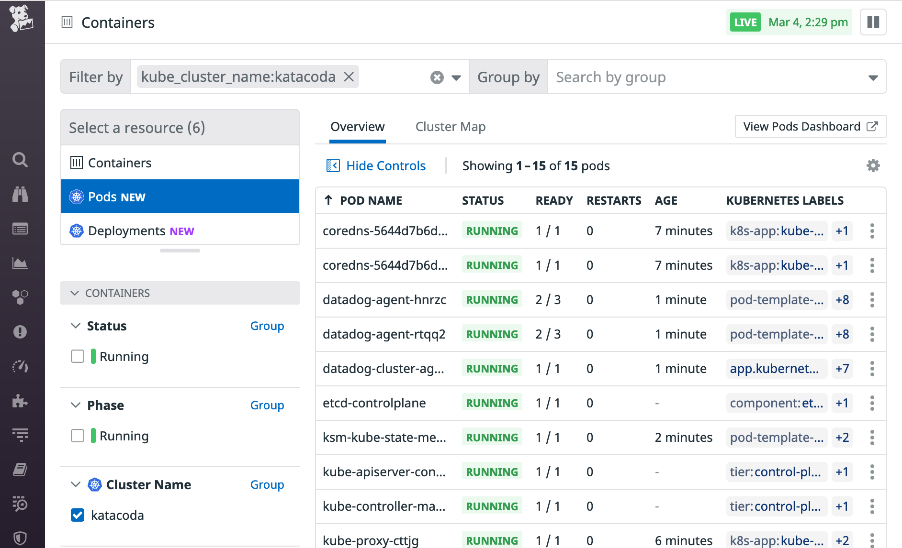

Let's see how we can add environment variables to the `DatadogAgent` definition and we will fix the Kubelet check in the process.

Let's run again the agent status command in the Datadog's agent pod running in the worker node:

`kubectl exec -ti $(kubectl get pods -l agent.datadoghq.com/name=datadog -l agent.datadoghq.com/component=agent -o custom-columns=:.metadata.name --field-selector spec.nodeName=node01) -- agent status`{{execute}}

We are getting the following error:

```
kubelet (7.0.0)
---------------
  Instance ID: kubelet:5bbc63f3938c02f4 [ERROR]
  Configuration Source: file:/etc/datadog-agent/conf.d/kubelet.d/conf.yaml.default
  Total Runs: 5
  Metric Samples: Last Run: 0, Total: 0
  Events: Last Run: 0, Total: 0
  Service Checks: Last Run: 0, Total: 0
  Average Execution Time : 7ms
  Last Execution Date : 2021-10-22 09:35:59 UTC (1634895359000)
  Last Successful Execution Date : Never
  Error: Unable to detect the kubelet URL automatically: impossible to reach Kubelet with host: 172.17.0.8. Please check if your setup requires kubelet_tls_verify = false. Activate debug logs to see all attempts made
  Traceback (most recent call last):
    File "/opt/datadog-agent/embedded/lib/python3.8/site-packages/datadog_checks/base/checks/base.py", line 1006, in run
      self.check(instance)
    File "/opt/datadog-agent/embedded/lib/python3.8/site-packages/datadog_checks/kubelet/kubelet.py", line 293, in check
      raise CheckException("Unable to detect the kubelet URL automatically: " + kubelet_conn_info.get('err', ''))
  datadog_checks.base.errors.CheckException: Unable to detect the kubelet URL automatically: impossible to reach Kubelet with host: 172.17.0.8. Please check if your setup requires kubelet_tls_verify = false. Activate debug logs to see all attempts made
```

That error happens because we cannot verify the Kubelet certificates correctly. As this is not a production environment, let's tell the Datadog agent to skip the TLS verification by setting the environment variable called `DD_KUBELET_TLS_VERIFY` to `false`.

Open the file called `dd-operator-configs/datadog-agent-kubelet.yaml`{{open}} and check how we have added a `env` section to the `agent` section to add the needed environment variable:

```
    env:
      - name: DD_KUBELET_TLS_VERIFY
        value: "false"
```

You can check the differences between the previous `DatadogAgent` configuration file and this new one running the following command: `diff -U1 dd-operator-configs/datadog-agent-tolerations.yaml dd-operator-configs/datadog-agent-kubelet.yaml`{{execute}}

Let's apply this new object description:

`kubectl apply -f dd-operator-configs/datadog-agent-kubelet.yaml`{{execute}}

You can follow the update from the `DatadogAgent` object status (type `Ctrl+C` to return to the terminal once you can see the agents running and ready):

`kubectl get datadogagent -w`{{execute}}

```
controlplane $ kubectl get datadogagent -w
NAME      ACTIVE   AGENT              CLUSTER-AGENT     CLUSTER-CHECKS-RUNNER   AGE
datadog   True     Updating (2/1/1)   Running (1/1/1)                           12m
datadog   True     Updating (2/1/1)   Running (1/1/1)                           13m
datadog   True     Running (2/1/2)    Running (1/1/1)                           13m
datadog   True     Running (2/2/2)    Running (1/1/1)                           13m
```

Once the updated pods are up and running, run again the agent status command in the Datadog's agent pod running in the worker node:

`kubectl exec -ti $(kubectl get pods -l agent.datadoghq.com/name=datadog -l agent.datadoghq.com/component=agent -o custom-columns=:.metadata.name --field-selector spec.nodeName=node01) -- agent status`{{execute}}

The Kubelet check should run now successfully:

```
kubelet (7.0.0)
---------------
  Instance ID: kubelet:5bbc63f3938c02f4 [OK]
  Configuration Source: file:/etc/datadog-agent/conf.d/kubelet.d/conf.yaml.default
  Total Runs: 4
  Metric Samples: Last Run: 597, Total: 2,371
  Events: Last Run: 0, Total: 0
  Service Checks: Last Run: 4, Total: 16
  Average Execution Time : 281ms
  Last Execution Date : 2021-10-22 09:38:40 UTC (1634895520000)
  Last Successful Execution Date : 2021-10-22 09:38:40 UTC (1634895520000)
```

With the Kubelet check now running successfully, we have now the full view on our processes, showing in our Live Containers view. Open now the [Live Containers view in Datadog](https://app.datadoghq.com/orchestration/overview/pod?cols=name%2Cstatus%2Cready%2Crestarts%2Cage%2Clabels&paused=false&sort=&tags=kube_cluster_name%3Akatacoda) to watch your Kubernetes objects directly from Datadog:

