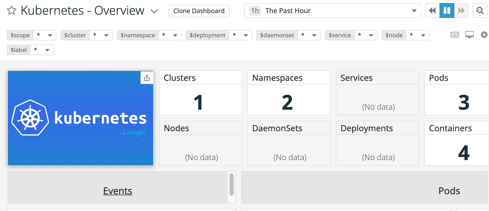

The Kubernetes integration comes with a default [dashboard](https://app.datadoghq.com/screen/integration/86) to help understand the data being collected.

Many widgets are empty; to populate the dashboard, a few integrations are required.
