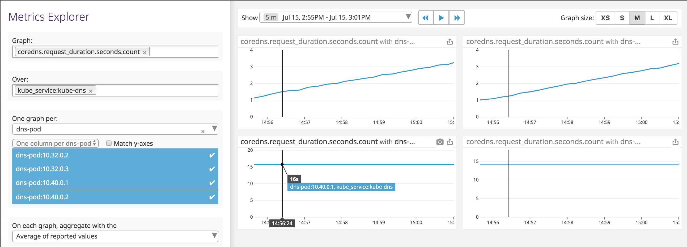

Now is time to deploy the Cluster Agent. Again, this is very easy to do using the Datadog's Helm chart.

We will enable deploy the Cluster Agent using this section of the Helm `values.yaml` file:

```
## @param clusterAgent - object - required
## This is the Datadog Cluster Agent implementation that handles cluster-wide
## metrics more cleanly, separates concerns for better rbac, and implements
## the external metrics API so you can autoscale HPAs based on datadog metrics
## ref: https://docs.datadoghq.com/agent/kubernetes/cluster/
#
clusterAgent:
  ## @param enabled - boolean - required
  ## Set this to true to enable Datadog Cluster Agent
  #
  enabled: true
```

You can read more on our [official documentation](https://docs.datadoghq.com/agent/kubernetes/log/?tab=helm).

You can view this new section opening this file: `assets/10c-deploy-cluster-agent/values.yaml`{{open}}. Navigate to line 396 to check the section.

* Apply the new `values.yaml`: <br/>
`helm upgrade datadogagent --set datadog.apiKey=$DD_API_KEY -f assets/10c-deploy-cluster-agent/values.yaml stable/datadog`{{execute}}

* Verify that the Cluster Agent is running: <br/>
`kubectl get pod -lapp=datadogagent-cluster-agent`{{execute}}

* Run the agent status command and check that the Node Agents can properly communicate with the Cluster Agent: `kubectl exec $(kubectl get pod -l app=datadogagent -ojsonpath="{.items[0].metadata.name}") agent status`{{execute}}

```
[...] 
=====================
Datadog Cluster Agent
=====================

  - Datadog Cluster Agent endpoint detected: https://10.106.63.237:5005
  Successfully connected to the Datadog Cluster Agent.
 ```

* You should now be getting metrics with cluster level metadata, which will come handy when troubleshooting traffic to the APIServer or to application services.

For instance, go check out the CoreDNS metrics broken down by `kube_service`:

We are able to identify how DNS requests are load balanced to the replicas from the service perspective.
