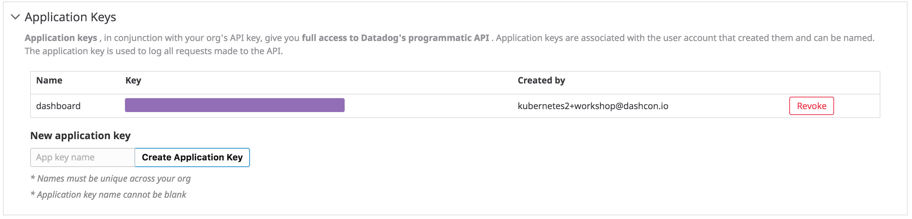

The Kubernetes control plane integrations provide metrics tailored to the performance of each component.

The control plane has several components that run in the `kube-system` namespace:
`kubectl get pods -n kube-system -o custom-columns=NAME:.metadata.name,NODE:spec.nodeName`{{execute}}

```
NAME                                   NODE
[...]
etcd-controlplane                      controlplane
kube-apiserver-controlplane            controlplane
kube-controller-manager-controlplane   controlplane
kube-scheduler-controlplane            controlplane
[...]
```

In this environment, the control plane pods (apiserver, controller-manager, scheduler) are deployed as [static pods](https://kubernetes.io/docs/tasks/administer-cluster/static-pod/) on the controlplane node.

* Verify that the checks are running for `etcd`, `kube_apiserver`, `kube_scheduler`, and `kube_controller_manager`: `k exec $(k get pod -l app=datadogagent --field-selector spec.nodeName=controlplane -ojsonpath="{.items[0].metadata.name}") agent status`{{execute}}

The `etcd` check was automatically run thanks to [Datadog's Autodiscovery feature](https://docs.datadoghq.com/agent/kubernetes/integrations/?tab=kubernetes), but it seems that the default configuration didn't work. The reason our metrics call is failing is that we aren't making that secure connection. We need to change the check configuration to point to the right certificates. How do we do that if the check was automatically run with Autodiscovery? Datadog's Autodiscovery feature allows to change the check configuration adding annotations to the pod that is the target of the check, in our case, the `etcd-controlplane` pod. You can learn more about adding the right annotations to your pods in our [official documentation](https://docs.datadoghq.com/agent/kubernetes/integrations/?tab=kubernetes#configuration).

But, where is the `etcd-controlplane` pod definition? The ETCD pod is defined as a [static pod in Kubernetes](https://kubernetes.io/docs/tasks/configure-pod-container/static-pod/#configuration-files). A folder in the file system can be watched by the Kubelet and start the pods that are described in that folder. In our environment this folder is `/etc/kubernetes/manifests`. Check the contents of that folder: `ls /etc/kubernetes/manifests`{{execute}}

Our pod definition is on the `etcd.yaml` file. We have created a new one that adds the following annotations to the pod:

```
  annotations:
    ad.datadoghq.com/etcd.check_names: '["etcd"]'
    ad.datadoghq.com/etcd.init_configs: '[{}]'
    ad.datadoghq.com/etcd.instances: |
      [
        {
          "prometheus_url": "https://%%host%%:2379/metrics",
          "ssl_verify": "false",
          "use_preview": "true",
          "ssl_ca_cert": "/keys/ca.crt",
          "ssl_cert": "/keys/peer.crt",
          "ssl_private_key": "/keys/peer.key"
        }
      ]
```

* Copy the one with annotations back the file to the static pods folder: `cp assets/11-control-plane/etcd.yaml /etc/kubernetes/manifests/`{{execute}}. The Kubelet will pick the new configuration and will restart the `etcd-controlplane` pod with the new configuration applied.

* Verify that the `etcd` check is now running correctly: `k exec $(k get pod -l app=datadogagent --field-selector spec.nodeName=controlplane -ojsonpath="{.items[0].metadata.name}") agent status`{{execute}}

Each control plane integration comes with a default dashboard: [etcd](https://app.datadoghq.com/screen/integration/75/etcd), [kube-scheduler](https://app.datadoghq.com/screen/integration/30270/kubernetes-scheduler), [kube-controller-manager](https://app.datadoghq.com/screen/integration/30271/kubernetes-controller-manager), and the kube-apiserver.

As an example for how to create custom dashboards in Datadog, we are going to create an overview of the whole control plane using the [Datadog API](https://docs.datadoghq.com/api/)

* Create an APP key in your [Datadog account](https://app.datadoghq.com/account/settings#api).


* Run the following API call using the JSON description of the dashboard located in `assets/11-control-plane/control_plane_json.json`{{open}}

`export DD_APP_KEY=<YOUR_APP_KEY>`{{copy}}

`curl -s -o /dev/null -X POST -H "Content-type: application/json" \
-d @assets/11-control-plane/control_plane_json.json \
"https://api.datadoghq.com/api/v1/dashboard?api_key=${DD_API_KEY}&application_key=${DD_APP_KEY}"`{{execute}}

Go check out your unified dashboard in the [Dashboard list](https://app.datadoghq.com/dashboard/lists?q=Kubernetes+Control+Plane)
