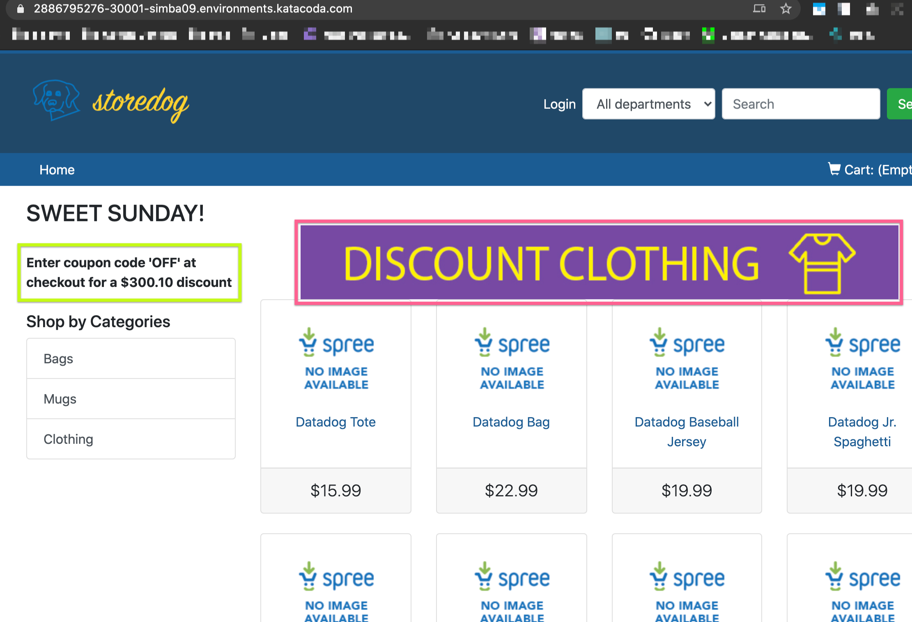

## Get familiar with the E-commerce app.

The ecommerce application has just been provisioned for you. You can check the different deployments that are part of the application by running the following command: `kubectl get deployment --selector=app=ecommerce`{{execute}}

You should get an output similar to this:

```
NAME             DESIRED   CURRENT   UP-TO-DATE   AVAILABLE   AGE
advertisements   1         1         1            1           4m
db               1         1         1            1           4m
discounts        1         1         1            1           4m
frontend         1         1         1            1           3m
```

The ecommerce application consists of a big monolith application called `frontend`, a microservice that serves advertisements, a microservice that serves discounts coupons and a postgres database.

Check that all the pods are running correctly by running the following command: `kubectl get pods --selector=app=ecommerce`{{execute}}

At this point you can visit the ecommerce application by clicking on the Ecommerce App tab in the terminal. Can you tell what areas of the web page are served by the `advertisements` and `discounts` microservices?

NB: If you see a big JavaScript error (`“JSON::ParserError in Spree::HomeController#index”`) or a 404, it is simply that the application has not had time to fully boot up.
Give it another minute and refresh the page.

