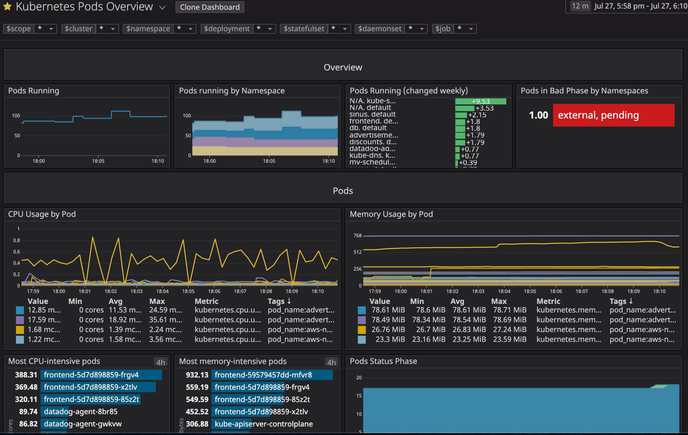

Datadog's Kubernetes integration comes with multiple out-of-the-box dashboards to help you understand the data being collected, and to help you monitor your applications and clusters.

In this step we will be taking a look at the Kubernetes specific data that the agent collects.
As we just deployed the agent, the dashboards might not show data just yet, make sure you wait a few minutes to get all widgets to populate data correctly.

At the highest level, you can use the [Kubernetes Overview dashboard](https://app.datadoghq.com/screen/integration/86/kubernetes---overview)

Note that this dashboard gives a good overview, but you can dig deeper into the different parts of Kubernetes.

At the node level for instance, you can see the high overview of how your applications are reporting with the [Kubernetes Node Overview dashboard](https://app.datadoghq.com/screen/integration/30340/kubernetes-nodes-overview)

If you want to go at a lower level you can take a look at the [Kubernetes Pod Overview dashboard](https://app.datadoghq.com/screen/integration/30322).

You can also monitor the different components of the Control Plane:

* [Kubernetes Scheduler](https://app.datadoghq.com/screen/integration/30270/kubernetes-scheduler)
* [Kubernetes Controller Manager](https://app.datadoghq.com/screen/integration/30271/kubernetes-controller-manager)
* [ETCD](https://app.datadoghq.com/screen/integration/30289/etcd-overview)

Most of these dashboards display data from metrics available on the Prometheus `/metrics` endpoints of the HTTP server running in these applications (e.g. apiserver, kubelet, etcd). In addition, Datadog Agent uses [kube-state-metrics](https://github.com/kubernetes/kube-state-metrics), also known as KSM. `kube-state-metrics` is a service that watches the Kubernetes API and generates metrics for the state of objects. You can find the official Datadog documentation [here](https://docs.datadoghq.com/integrations/kubernetes/#setup-kubernetes-state) for the check.

Datadog Agent will automatically discover the `kube-state-metrics` pods and collect metrics from their `/metrics` endpoint.

Let's verify that the agent is collecting KSM metrics by running the `status` command in datadog-agent pod that also runs in the `node01` node by executing the following commands:

* `NODE01POD=$(kubectl get pod -l app=datadogagent --field-selector spec.nodeName=node01 -o custom-columns=:metadata.name)`{{execute}}

* `kubectl exec -ti $NODE01POD -- agent status`{{execute}}

Look for:

    kubernetes_state (5.4.1)
    ------------------------
      Instance ID: kubernetes_state:9e3b5144d45748a3 [OK]
      Configuration Source: file:/etc/datadog-agent/conf.d/kubernetes_state.d/auto_conf.yaml
      Total Runs: 20
      Metric Samples: Last Run: 576, Total: 10,944
      Events: Last Run: 0, Total: 0
      Service Checks: Last Run: 8, Total: 152
      Average Execution Time : 82ms
      Last Execution Date : 2020-07-29 16:07:02.000000 UTC
      Last Successful Execution Date : 2020-07-29 16:07:02.000000 UTC
