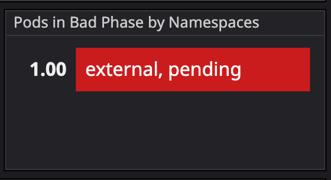
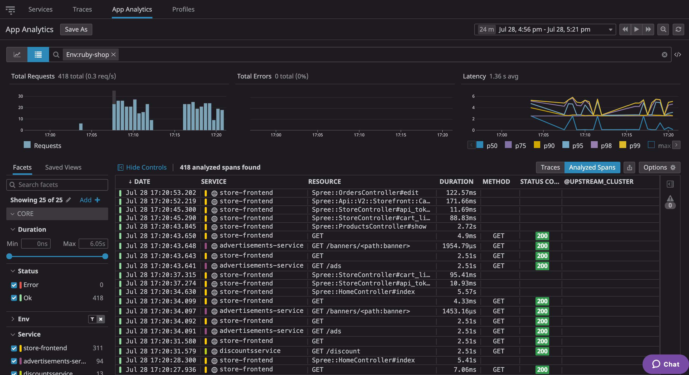

Now that you are familiar with the ecommerce application, let's investigate the issue introduced by Bob.

Start by opening the [Kubernetes Pod Overview dashboard](https://app.datadoghq.com/screen/integration/30322), and make yourself familiar with the metrics represented. 

Identify what is going on, and come back to the terminal to confirm the issue.

Hint

In the dashboard you should see that a pod is reporting in a "bad phase" in the "external" namespace.

We have not seen it in the terminal because `kubectl` is configured to show the `default` namespace.
Go back to the terminal and describe the pod in the external namespace to see what is wrong.

Pay close attention to the `command` section...

Once you have identified the issue, try to fix it - Make sure you read the solution before moving forward.

Solution

The issue is that the load-balancer-traffic pod was not showing up until now because we had never talked about the `external` namespace.
A great flag to use to see resources accross every namespace is `kubectl get XXX --all-namespaces`.

As you describe the load-balancer-traffic pod you will notice that the command it is trying to run is wrong.

You can execute the following command to remove it:
`kubectl patch deploy load-balancer-traffic -n external --type json -p='[{"op": "remove", "path": "/spec/template/spec/containers/0/command"}]'`{{execute}}

Once the situation is solved, you should start seeing traces reporting into your Datadog account. 
Go to the [APM page ](https://app.datadoghq.com/apm/traces?query=env%3Aruby-shop)

