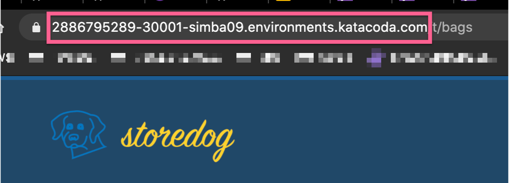
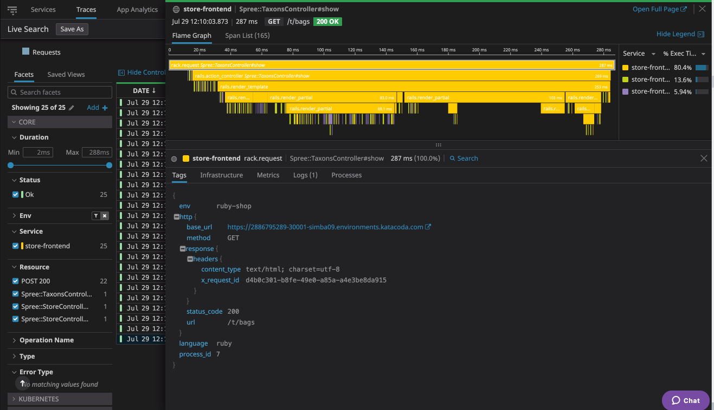

Now that the load balancer pod is fixed, you should see the traces coming in - Congrats, you are receiving traffic from the world!

In order to get a good grasp at how traces are correlated to the activity on the ecommerce website, open the Ecommerce App tab and click on items (to simulate a user's journey).

Take note of the Load Balancer's url:

Then go to the [Trace page](https://app.datadoghq.com/apm/traces) and use the following query:

`env:ruby-shop @http.base_url:"https://XXX-XXX-XXX.environments.katacoda.com"`

In this example the Load Balancer is `2886795289-30001-simba09`, so the query is

`env:ruby-shop @http.base_url:"https://2886795289-30001-simba09.environments.katacoda.com"`

Once entered you should see the traces, through the different stack of the ecommerce website

This _could_ be a useful tool to leverage later on...

The CTO requested that we have a better understanding of how the differet applications request information about Kubernetes objects and that we have tooling in place to audit everything. Let's get back to the presentation.