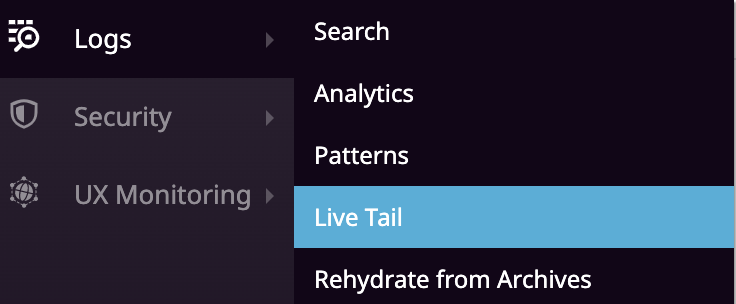
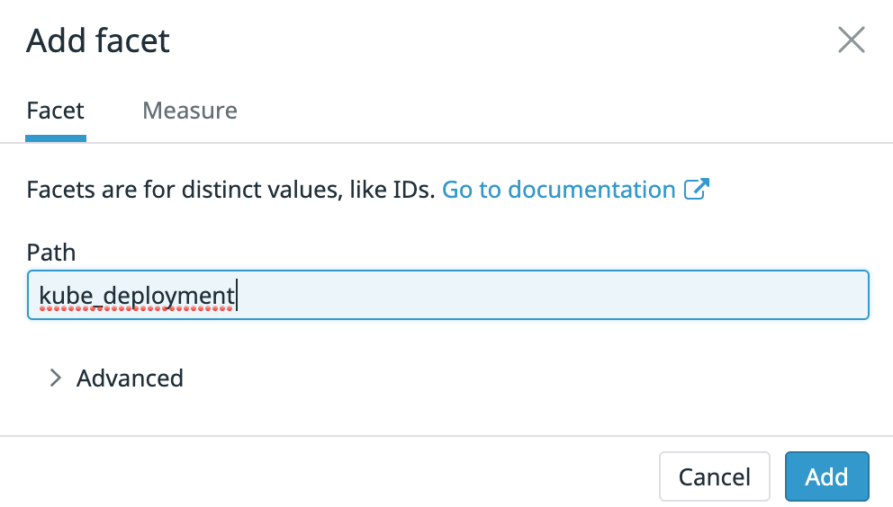
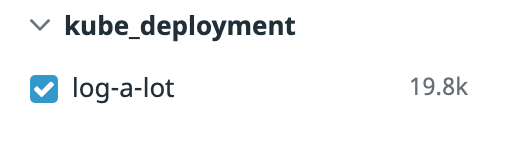

Live tail shows a realtime stream of all logs as they are ingested. In order to demonstrate live tail, we'll deploy a sample application that logs one message every second per replica.

* Deploy the sample application:
`kubectl apply -f assets/10-live-tail/log-a-lot.yaml`{{execute}}

* Visit the live tail page by click from the left navigation pane: Logs > Live Tail.

* Filter logs shown in live tail to the `log-a-lot` application.

To demonstrate live tail sampling and streaming, let's increase the replica count.

* Increase the replica count:
`kubectl scale deployment log-a-lot --replicas 30`{{execute}}

* Validate your new pods are running.

* Observe traffic in live tail as it's sampled according to volume.

* Before moving to the next step, let's scale back this sample app to zero to
  get a clean environment again:
`kubectl scale deployment log-a-lot --replicas 1`{{execute}}
