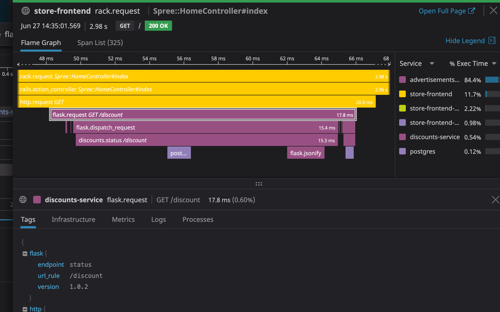

## Your mission: deploy a fix to the issue in the `discount-service` and reduce the latency to an healthy level

Can you interpret the pattern in the flame graph to classify the type of problem with the database query?

<details>
<summary>Hint 1</summary>

The problem is a lazy lookup on a relational database. 

</details>

Can you identify the code changes needed in `\assets\discounts.py` to fix the latency issue?

<details>
<summary>Hint 2</summary>

By changing the line:

discounts = Discount.query.all()

To the following:

```
discounts = Discount.query.options(joinedload('*')).all()
```

We eager load the `discount_type` relation on the `discount`, and can grab all information without multiple trips to the database. 

</details>

Let's deploy the fixed version by running `kubectl deploy -f ...`. 

Can you verify that the latency issue is no longer happening?

<details>
<summary>Hint 3</summary>

Try the following:

* Go to the [Service Overview](https://app.datadoghq.com/apm/service/store-frontend/rack.request) page and look how the latency of the app is going down. 
* Go to the [Traces page](https://app.datadoghq.com/apm/traces) and look at one of the traces from the fixed service, they should look like this:

* Go to the [SLO status page](https://app.datadoghq.com/slo) and look for the current status of the service SLO you previously created.
</details>

### Complete this step by verifying that the latency of the service `store-frontend` went down significally. Continue to the next step afterwards.