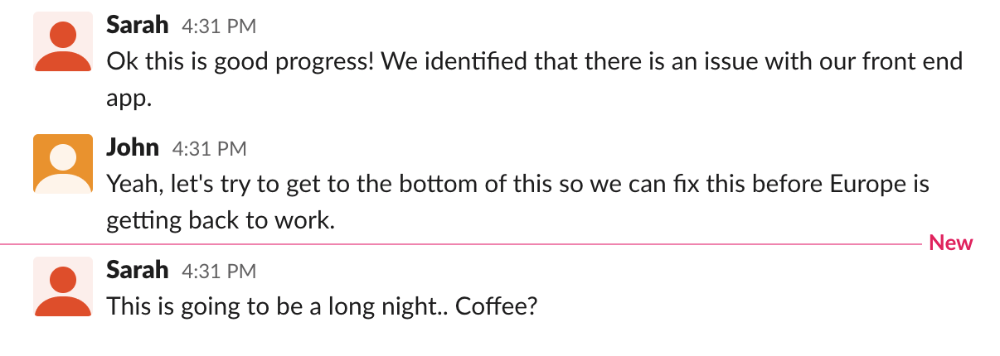

## Your mission: understand the root cause for the high latency in `store-frontend`

In order to fix the problem, you would need to understand where the issue is and propose a solution. Use Datadog to find the root cause for the high latency.

You already know the service and the endpoint. Where would you look next? 

Is there an issue with the infrastructure such as low available resources? 

Maybe we need to scale up the deployment? 

Or maybe our developers rolled out a new version which has a bug of some sort?

* Complete this step by finding out the other microservice that is causing `store-frontend` latency, and by finding out what the microservice is doing that takes so much time. Continue to the next step afterwards, in which you will find a way to fix the issue.

Hint 1

Analyzing a distributed trace in Datadog can show you where your application spend the most time, and can help you understand how to solve performance issues.

Let's try to analyze an application request that took a long time to return a response to the user.

Go to the [Traces page](https://app.datadoghq.com/apm/traces) and use the left-hand facets to filter on:
** Duration larger than 5s
** Service: store-frontend

You should now see a list of all the traces that meet this search criteria. Click on one of the traces to get more details.

Investigate the flame graph, container metrics, application logs, and processes from each of the services involved in the request.

Can you spot the issue? 

  

Hint 2

It seems like we consistently spend over 2 seconds in the advertisements service.

Take a look at the code of the advertisements microservice in `assets/workshop-assets/ads.py` and try to find why so much time is spent in the service.

