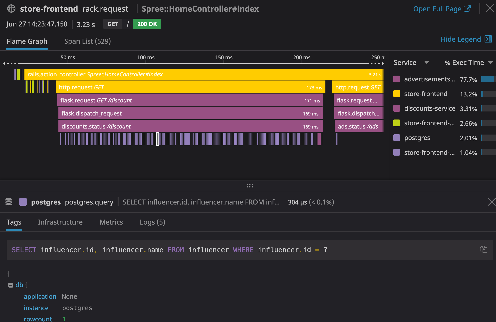

## Your mission

Identify the issue affecting the Database and try to find a fix that would reduce the latency to a healthy level.

* Can you interpret the pattern in the flame graph to classify the type of problem with the database query?

<details>
<summary>Hint 1</summary>

It seems like there is a problem in how `discounts-service` is accessing the database:


It doesn't seem to be an efficient way to query the database, can you find out why?
</details>

Can you identify the code changes needed in `/assets/workshop-assets/discounts.py` to fix the latency issue?

<details>
<summary>Hint 2</summary>

The problem is a lazy lookup on a relational database. 

By changing the line:

```
discounts = Discount.query.all()
```

To the following:

```
discounts = Discount.query.options(joinedload('*')).all()
```

We eager load the `discount_type` relation on the `discount`, and can grab all information without multiple trips to the database. 

</details>


Let's deploy the fixed version by running `kubectl patch deploy discounts --patch="$(cat assets/workshop-assets/apps/fixes/discounts.yaml)"`{{execute}}.

Can you verify that the latency issue is no longer happening?

<details>
<summary>Hint 3</summary>

Try the following:

* Go to the [Service Overview](https://app.datadoghq.com/apm/service/store-frontend/rack.request) page and look how the latency of the app is going down.
Example of the P50:


* Go to the [Traces page](https://app.datadoghq.com/apm/traces) and look at one of the traces from the fixed service, they should look like this:

* Go to the [SLO status page](https://app.datadoghq.com/slo) and look for the current status of the service SLO you previously created.

</details>

* Complete this step by verifying that the latency of the service `store-frontend` went down significantly.

Seems like we covered the internal issues as well!