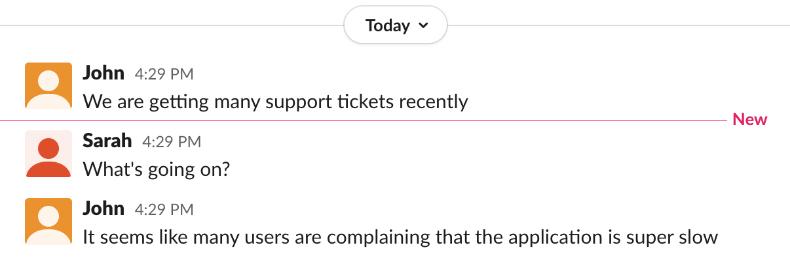

... 24 days later ...

## Your mission: identify which part of the application is slow

Try to find the relevant pages in Datadog that will give you a clue of where the slowness issue may be, so you can start the troubleshooting from. 

Should you start looking at infrastructure metrics, application logs, or maybe something else?

Hints

An high application latency is usually a good indicator for a performance issue. Since we received complaints from end-users, we know that the issue involves at least one service that end-users interact with (directly or indirectly).

The [Service Map page](https://app.datadoghq.com/apm/map) can give you a clear picture of each application service performance. Hover your mouse over each of the services to find the service with a problematic latency. 

  

Hints

The service `store-frontend` has a latency of more than a few seconds. Click on it and choose [View Service Overview](https://app.datadoghq.com/apm/service/store-frontend/rack.request) to look at the application performance metrics more closely. You can scroll down to the Endpoints section to find the problematic endpoint.

