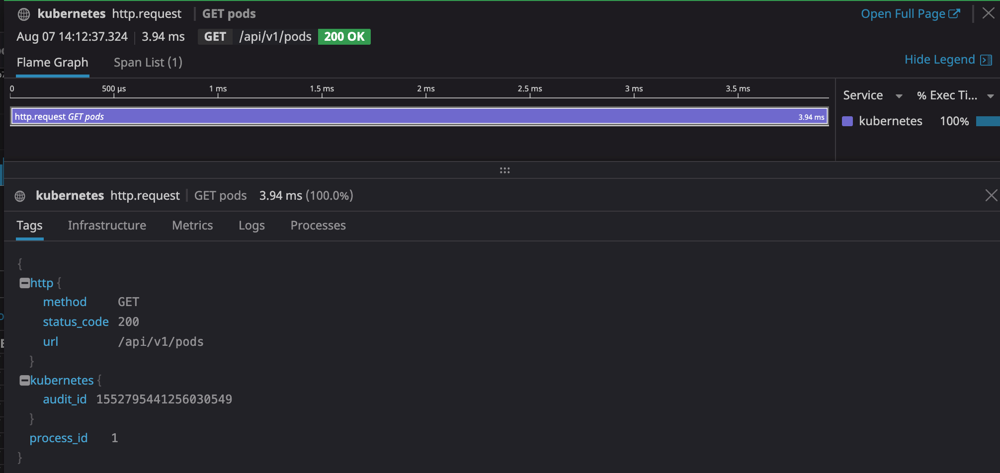

In the previous troubleshooting steps, we focused on the `pod-lister`
application and its interactions with the Kubernetes API (RBAC,
watches/informers).

In this step your goal is to patch the source code of the pod lister, that you
can find in `assets/workshop-assets/apps/sample-pod-lister` in Katacoda or you can also clone it
at
https://github.com/LeoCavaille/k8s-workshop/tree/master/assets/apps/sample-pod-lister.

The goal of your patch will be to add APM tracing to the Kubernetes client, you
can find the documentation for the client tracing at:

* https://docs.datadoghq.com/tracing/setup/go/
* https://godoc.org/gopkg.in/DataDog/dd-trace-go.v1/contrib/k8s.io/client-go/kubernetes

Then visit the [APM page](https://app.datadoghq.com/apm/intro) and you should
start seeing your first traces.

You can toggle again the behavior between the "simple" pod list calls and the
Kubernetes informer and watch the difference of throughput & latency performance
of these calls (using the `USE_WATCH` environment variable).

<details>
<summary>Hint</summary>

You will want to import the client-go tracer and add the WrapTransport method to the client as follows:
```

import (
	[...]
	tracekube gopkg.in/DataDog/dd-trace-go.v1/contrib/k8s.io/client-go/kubernetes
	[...]
)

[...]
	config, err := rest.InClusterConfig()
	if err != nil {
		panic(err)
	}

    config.WrapTransport = tracekube.WrapRoundTripper # magic

	clientset, err := kubernetes.NewForConfig(config)
	if err != nil {
		panic(err)
	}
[...]
```
</details>

If you do not want to rebuild the binary and the Docker image, check out the solution below!

<details>
<summary>Solution</summary>

You could build the binary using: `go build -o sample-pod-lister`.

Then log into your container registry (Dockerhub for instance) and create a docker image with the binary: `docker build -t <Your Dockerhub repo>/<sample-pod-lister>:tracing .`, then push it `docker push  <Your Dockerhub repo>/<sample-pod-lister>:tracing`!

If you are not familiar with go, do not have a Dockerhub account or simply want to see the solution, you can also use the image `charlyyfon/sample-pod-lister:tracing` in the deployment.

Feel free to apply the following patch:
`kubectl patch deploy pod-lister --patch="$(cat assets/workshop-assets/apps/fixes/sample-pod-lister-tracing.yaml)"`{{execute}}.

</details>

Once you have it, you should be seeing the round trip calls made to the APIServer!
Look for the service `kubernetes`

