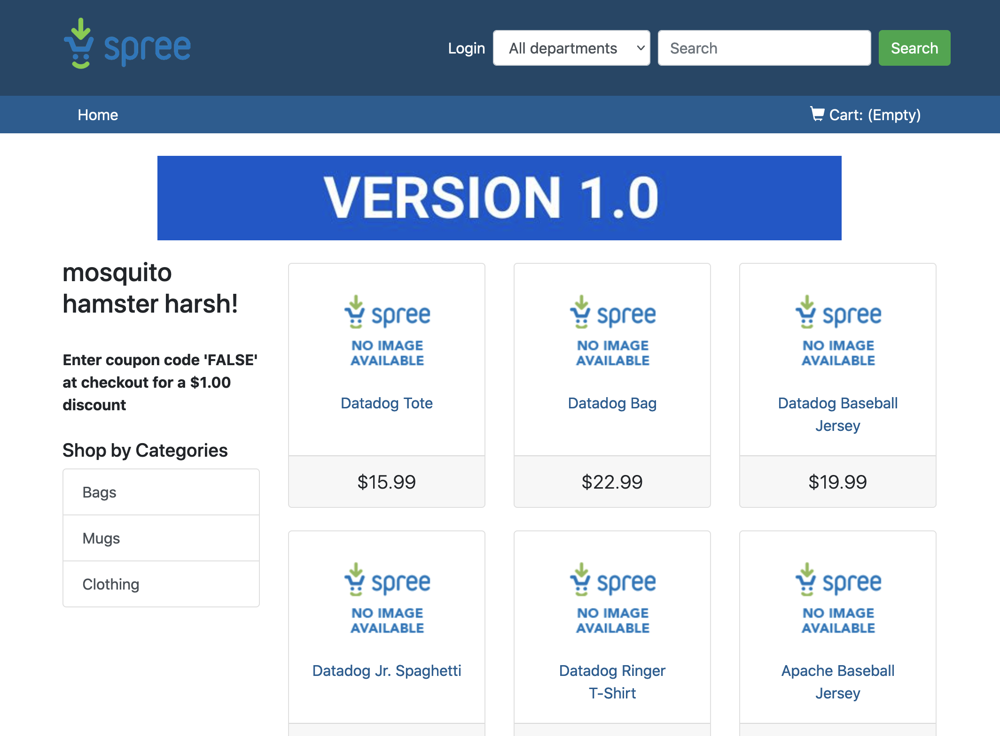

Let's start working with Istio. Istio is already deployed for you in the `istio-system` namespace. Have a look to the different deployments in that namespace running the following command: `kubectl get deploy -n istio-system`{{execute}}. You should get an output similar to this one:

```
NAME                   READY   UP-TO-DATE   AVAILABLE   AGE
istio-egressgateway    1/1     1            1           37m
istio-ingressgateway   1/1     1            1           37m
istiod                 1/1     1            1           38m
```

Datadog comes with an out-of-the-box Istio integration. Open [the integration tile in Datadog](https://app.datadoghq.com/account/settings#integrations/istio) and if it is not already install it, click on Install:


We are going to tell Istio to add the Envoy proxy to any pod deployed to namespace `ns3`, by adding it the label `istio-injection`:

`kubectl label namespace ns3 istio-injection=enabled`{{execute}}

Now we are going to deploy the E-commerce application again, this time in this Istio enabled namespace. You can check the differences between our original deployment and this one by running this command: `diff -u manifest-files/ecommerce-v1 manifest-files/istio/ecommerce-istio`{{execute}}. You can see that the main difference (aside from the change in namespace) is that we have changed the type of Service for the `frontend` service to `ClusterIP`, making it unaccessible from outside the cluster:

```
-  type: NodePort
+  type: ClusterIP
```

Let's now deploy the E-commerce application in the `ns3` namespace:

`kubectl apply -f manifest-files/istio/ecommerce-istio -n ns3`{{execute}}

Let's check the pods that are now running in that namespace: `kubectl get pods -n ns3`{{execute}} You should get an output similar to this one (If not all containers are Ready yet, you can execute this command several times, until you get all pods up and running):

```
NAME                              READY   STATUS    RESTARTS   AGE
advertisements-849fdbfbb9-8v255   2/2     Running   0          6m45s
discounts-8468fb698c-p952n        2/2     Running   0          6m45s
frontend-575bd7dddb-kqnkw         2/2     Running   0          6m45s
```

As you can see, instead of just one container per pod, we are now getting two containers per pod. Let's check the pods to see what container is running alongside our application: `kubectl get pods -n ns3 -o custom-columns=NAME:.metadata.name,CONTAINERS:".spec.containers[*].image"`{{execute}}. You should get an output similar to this one:

```
NAME                              CONTAINERS
advertisements-849fdbfbb9-8v255   arapulido/ads-service:1.0,docker.io/istio/proxyv2:1.10.2
discounts-8468fb698c-p952n        ddtraining/discounts-fixed:latest,docker.io/istio/proxyv2:1.10.2
frontend-575bd7dddb-kqnkw         arapulido/frontend:1.0,docker.io/istio/proxyv2:1.10.2
```

As you can see, Istio has injected an Envoy proxy container into each of the pods deployed to namespace `ns3`. All comunication between those pods will happen through the Envoy proxy sidecar containers.

The E-commerce application is deployed to namespace `ns3` but not accessible from the outside. To make it accessible, create an [Istio Ingress Gateway](https://istio.io/latest/docs/concepts/traffic-management/#gateways), which is similar to the Kubernetes Ingress object, but specific for Istio.

Open the file called `manifest-files/istio/frontend-gateway.yaml`{{open}}. Browse it around to understand what we are doing here. Basically, we are saying that for any path, and any host, to redirect all external traffic to our `frontend` service in namespace `ns3`.

Let's apply it: `kubectl apply -f manifest-files/istio/frontend-gateway.yaml`{{execute}}

Once the Gateway and VirtualService objects have been created, click on the "Istio Ingress Gateway" to access the E-commerce application through Istio Gatway:



Let's open the [Istio default dashboard](https://app.datadoghq.com/screen/integration/30320/istio-overview-v15) to see what metrics we are getting from our Istio deployment:


The "Mesh Metrics" section will collect metrics around the application services that Istio that are part of the mesh. In our case, our E-commerce application running in the `ns3` namespace. The rest of the metrics check for the correct behaviour of Istio in our cluster. As a key component of a cluster, it is very important that we track these Istio metrics and understand them. Although monitoring Istio is out of scope for this workshop, you can read what these metrics are and how to interpret them in [this blog post](https://www.datadoghq.com/blog/istio-metrics/).
