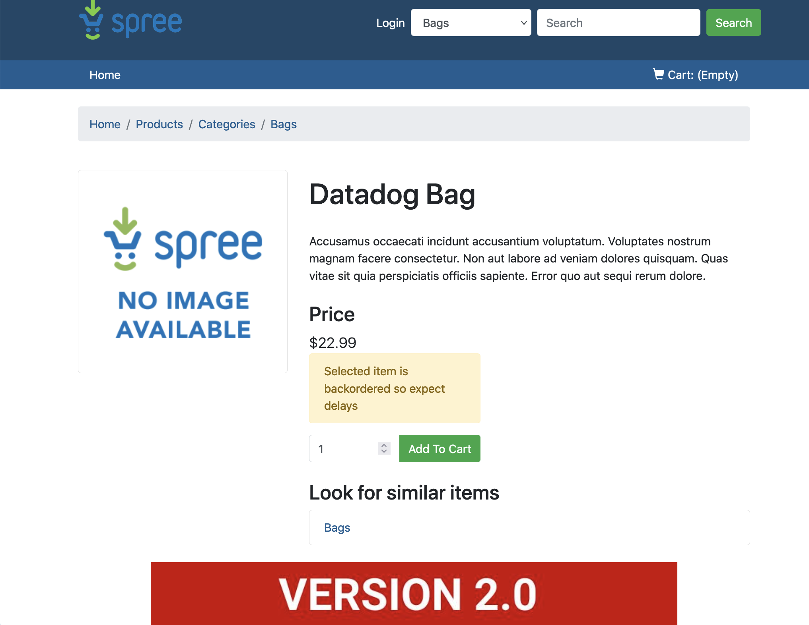

As you have seen, VirtualServices can be used to bind traffic from a Gateway to a particular internal Kubernetes "host", but VirtualServices can be used to create rules to manage internal traffic as well.

We are going to use VirtualServices in combination with [DestinationsRules](https://istio.io/latest/docs/reference/config/networking/destination-rule/) to be able to create a canary deployment for the `advertisements` service. Destination Rules are rules to configures what happens to your network traffic once it has reached the destination defined in a Virtual Service.

We are going to create a second deployment of the `advertisements` container. Open the file called `manifest-files/istio/ads_v2/advertisements_v2.yaml`{{open}} Can you spot the differences between this deployment and the current one running on namespace `ns3`. You can see the differences running this command: `diff -u manifest-files/istio/ecommerce-istio/advertisements.yaml manifest-files/istio/ads_v2/advertisements_v2.yaml`{{execute}}

You can see that we have modified the image, the `DD_VERSION` and now we have also modified the `version` label. Let's apply that manifest: `kubectl apply -f manifest-files/istio/ads_v2/advertisements_v2.yaml`{{execute}}

Open again the Istio Ingress Gateway tab again and refresh it several times. You can see that sometimes you are getting the "Version 1.0" banner and sometimes you get the "Version 2.0" banner. This is not because of Istio, this is because general Service Networking, as we saw on the first scenario. The `advertisements` Service is selecting both pods, so half the time we will get the first one, and half the time we will get the second. We are going to configure Istio to modify those canary rules.

Istio uses labels to be able to define different versions of the same service. To define those different versions we will use a `DestinationRules` object. Open the file called `manifest-files/istio/ads_v2/destinationrule.yaml`{{open}}

In that file we are defining two different subsets of pods for the `advertisements` host: `v1` for pods with the label `version=v1` and `v2` for pods with the label `version=v2`. Let's apply that object: `kubectl apply -f manifest-files/istio/ads_v2/destinationrule.yaml`{{execute}}

When the `frontend` service calls the `advertisements` service it always calls this endpoint: `http://advertisements:5002/ads`, but it sends a different value for the HTTP header `page-source` depending from what page the service is called from. When you see the ads banner from the home page, the value for the `page-source` header is `home`, but when you click on a product, and get the ads banner at the bottom of the page, the value for the `page-source` header in the request to `http://advertisements:5002/ads` is `products`.

Our business team have an hypothesis about the advertisement shown in the product pages. As a customer seeing that advertisement has already express interest in a product, it is more likely to click on a relevant advertisement. To try to prove their theory, they want 50% of the customer visiting a product to get version 2.0 of the advertisement service, with this new feature, and 50% the current version 1.0. Customers reaching the home page would need to always get version 1.0.

We need to create a `VirtualService` object to define routing rules for the `advertisements` host. Open the file called `manifest-files/istio/ads_v2/virtualservice.yaml`{{open}}

We are defining that for any traffic addressed to `advertisements` we are creating a special route for those requests in which the `page-source` header value is `products`, meaning that the `advertisements` service was called from a product page. In those cases, 50% of the traffic will go to version 1.0 of the service, and 50% to version 2.0. If the header is not present or has a different value, then 100% of the time it will reach version 1.0 of the service.

```
[...]
  - match:
    - headers:
        page-source:
          exact: "products"
    route:
    - destination:
        host: advertisements
        subset: v1
      weight: 50
    - destination:
        host: advertisements
        subset: v2
      weight: 50
[...]
```

Let's apply that object: `kubectl apply -f manifest-files/istio/ads_v2/virtualservice.yaml`{{execute}}

Open again the Istio Ingress Gateway tab again and refresh it several times. You are now getting the "Version 1.0" banner 100% of the times, as you are in the home page.

Click now on any of the products and refresh that page several times. You should now be getting about half the time the "Version 1.0" banner, and half of the time the "Version 2.0" banner.


