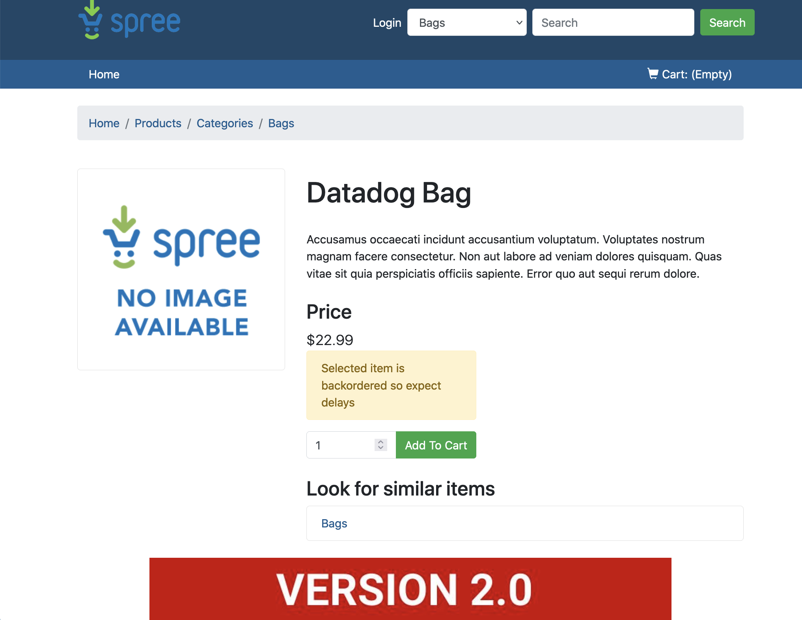

When the `frontend` service calls the `advertisements` service it always calls this endpoint: `http://advertisements:5002/ads`, but it sends a different value for the HTTP header `page-source` depending from what page the service is called from. When you see the ads banner from the home page, the value for the `page-source` header is `home`, but when you click on a product, and get the ads banner at the bottom of the page, the value for the `page-source` header in the request to `http://advertisements:5002/ads` is `products`.

Our business team have an hypothesis about the advertisement shown in the product pages. As a customer seeing that advertisement has already expressed interest in a product, they are more likely to click on a relevant advertisement. To try to prove their theory, they want 50% of the customers visiting a product to get version 2.0 of the advertisement service, with this new feature, and 50% the current version 1.0. Customers reaching the home page would need to always get version 1.0.

We need to create a `VirtualService` object to define routing rules for the `advertisements` host. Open the file called `manifest-files/istio/ads_v2/virtualservice.yaml`{{open}}

We are defining that for any traffic addressed to `advertisements` we are creating a special route for those requests in which the `page-source` header value is `products`, meaning that the `advertisements` service was called from a product page. In those cases, 50% of the traffic will go to version 1.0 of the service, and 50% to version 2.0. If the header is not present or has a different value, then 100% of the time it will reach version 1.0 of the service.

```
[...]
  - match:
    - headers:
        page-source:
          exact: "products"
    route:
    - destination:
        host: advertisements
        subset: v1
      weight: 50
    - destination:
        host: advertisements
        subset: v2
      weight: 50
[...]
```

Let's apply that object: `kubectl apply -f manifest-files/istio/ads_v2/virtualservice.yaml`{{execute}}

Open again the Istio Ingress Gateway tab again and refresh it several times. You are now getting the "Version 1.0" banner 100% of the times, as you are in the home page.

Click now on any of the products and refresh that page several times. You should now be getting about half the time the "Version 1.0" banner, and half of the time the "Version 2.0" banner.


