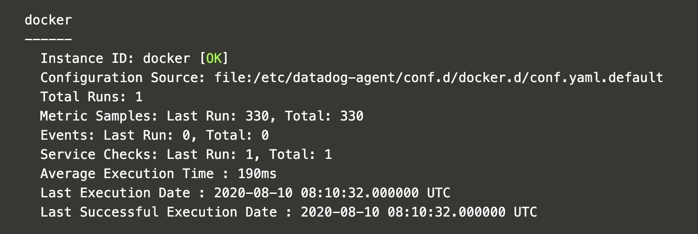

Wait some minutes until your environment is setup. Once it is setup, you will see the following message in your terminal:`OK, the training environment is installed and ready to go.`

The first thing we are going to do is to deploy the Datadog Helm chart passing our API key:

`helm install datadog --set datadog.apiKey=$DD_API_KEY datadog/datadog -f manifest-files/datadog/datadog-helm-values.yaml --version=2.16.6`{{execute}}

Let's check the workloads that have been deployed:

`kubectl get deployments`{{execute}}

```
NAME                         READY   UP-TO-DATE   AVAILABLE   AGE
datadog-cluster-agent        1/1     1            1           5s
datadog-kube-state-metrics   1/1     1            1           1m
```

`kubectl get daemonset`{{execute}}

```
NAME      DESIRED   CURRENT   READY   UP-TO-DATE   AVAILABLE   NODE SELECTOR            AGE
datadog   1         1         1       1            1           kubernetes.io/os=linux   22h
```

The Datadog Helm chart, by default, deploys three workloads: the [Datadog Node Agent](https://docs.datadoghq.com/agent/kubernetes/?tab=helm), the [Datadog Cluster Agent](https://docs.datadoghq.com/agent/cluster_agent/), and [Kube State Metrics](https://github.com/kubernetes/kube-state-metrics) by default. Kube State Metrics is a service that listens to the Kubernetes API and generates metrics about the state of the objects. Datadog uses some of these metrics to populate its Kubernetes default dashboard.

Wait until the Datadog agent is running by executing this command: `wait-datadog.sh`{{execute}}

Once the `datadog` pod is running, let's check its status by running the following command: `kubectl exec -ti ds/datadog -- agent status`{{execute}} Browse the output. What checks is the Datadog agent running? If the `docker` check is not yet running, rerun the command above until you see the `docker` check running before moving to the next step.



Note: if you get the following output: `Error: unable to read authentication token file: open /etc/datadog-agent/auth_token`, just rerun the command, as this is a transient error.

We will leave the Datadog agent running, collecting metrics and logs from our cluster, and sending them to Datadog.
