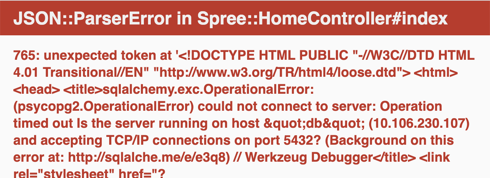

The ecommerce application is already provisioned for you in the `ns1` namespace. You can check the different deployments that are part of the application by running the following commands: `kubectl get deployment -n ns1 --selector=app=ecommerce && kubectl get deployment -n database`{{execute}} 

You should get output similar to this:

```
NAME             READY   UP-TO-DATE   AVAILABLE   AGE
advertisements   1/1     1            1           15m
discounts        1/1     1            1           15m
frontend         1/1     1            1           15m
NAME   READY   UP-TO-DATE   AVAILABLE   AGE
db     1/1     1            1           15m
```

The ecommerce application consists of a big monolith application called `frontend`, a microservice that serves advertisements, a microservice that serves discounts coupons and a postgres database.

Check that all the pods are running correctly by running the following command: `kubectl get pods -n ns1 --selector=app=ecommerce && kubectl get pods -n database`{{execute}}

At this point you can visit the ecommerce application by clicking on the Ecommerce App tab in the terminal. Browse around to familiarize yourself with the application. Can you tell what areas of web page are served by the `advertisements` and `discounts` microservices?

To make it clearer when we are doing our progressive delivery, version `1.0` of the `advertisements` service is always serving an ad banner that clearly says `Version 1.0` so we can compare it easily.


Note: if you get an error like the one shown below, please refresh the page. It happens when the database is still initializing:

