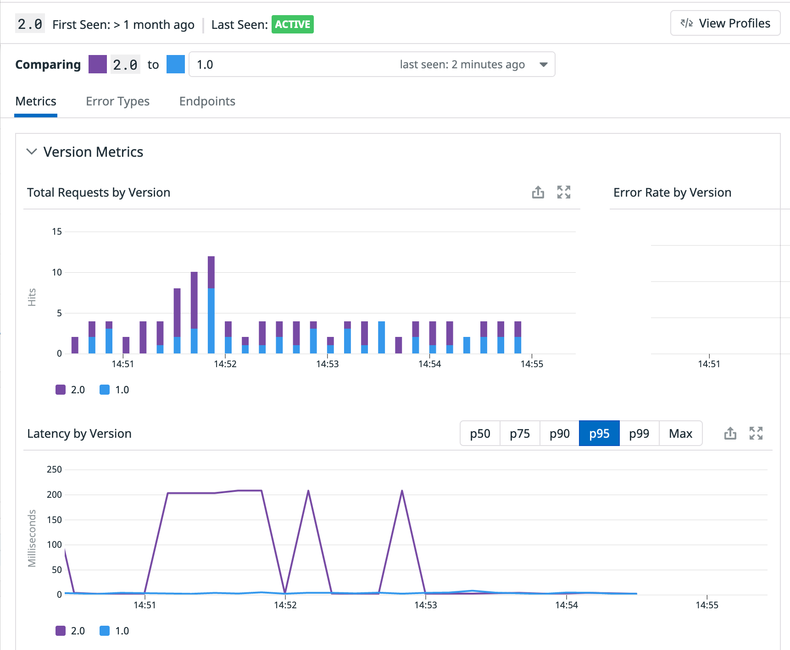

We are going to apply a second deployment for the `advertisements` service, that uses a different docker image label, that makes the ads service to always deliver a banner that states `Version 2.0`, so we can easily distinguish it.

Open the file called `manifest-files/servicenetwork/advertisements.yaml`{{open}} and try to spot the differences with the original one. You can spot the differences running the following `diff` command: `diff -u manifest-files/ecommerce-v1/advertisements.yaml  manifest-files/servicenetwork/advertisements.yaml`{{execute}}

As you can see we have modified the image tag and the value for the `DD_VERSION` environment variable, to make sure we can track correctly both versions in Datadog. Also, you can see that this second deployment will have the exact same labels as the first one, and, therefore, will be selected by the `advertisements` service selector as well.

Let's apply this second deployment: `kubectl apply -f manifest-files/servicenetwork/advertisements.yaml`{{execute}}

We have now two different deployments with the same set of labels, running different docker images: `kubectl get deployments -n ns1 -l service=advertisements --show-labels`{{execute}}. The pods that are part of each of these deployments also share the set of labels: `kubectl get pods -n ns1 -l service=advertisements --show-labels`{{execute}}

The `advertisements` service will select any pod that matches those two common labels: `kubectl get svc advertisements -n ns1 -o custom-columns="Name:metadata.name,Selector:spec.selector"`{{execute}}, and it will select one of the two randomnly with the same weight.

Go back to the Ecommerce application and refresh the page. Sometimes you should get the ads banner "Version 1.0" and sometimes you will get the one with "Version 2.0", confirming that we have completed a Blue/Green deployment.

Let's go back to our [Advertisements Service Overview page](https://app.datadoghq.com/apm/service/advertisements/). Datadog is now tracking two different versions of the `advertisements` service:

Click on the `2.0` row under "Deployments" and you will get a comparison between the two versions:

Are we getting new errors? Is the latency of the two versions similar? Are we happy with progressively moving this release forward or shall we rollback?

Progressive delivery and a correct observability strategy can help you making these decisions. In this case we can clearly see that the new version of the `advertisements` service is adding extra latency (about 200ms). Something is wrong with this release. We can quickly rollback before moving the release forward to avoid this extra latency reaching more of our customers and investigate the root cause.

**IMPORTANT**: Before continuing, let's revert the second version of the `advertisements` service to make sure the rest of the labs work correctly: `kubectl delete -f manifest-files/servicenetwork/advertisements.yaml`{{execute}}
