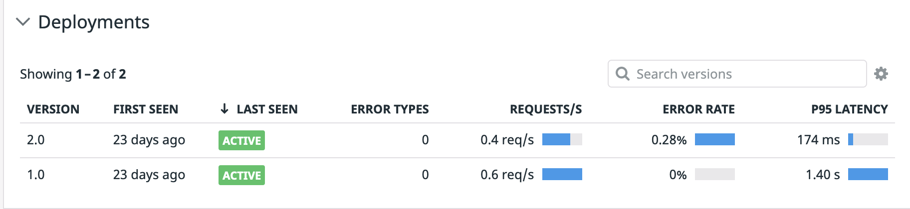
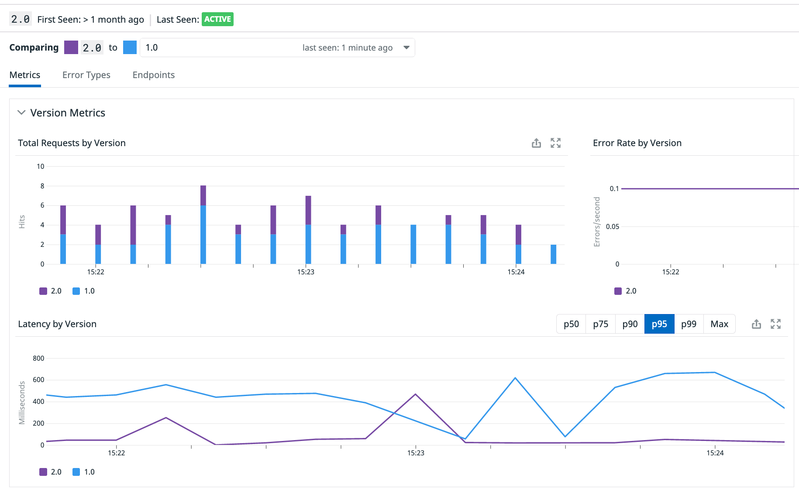
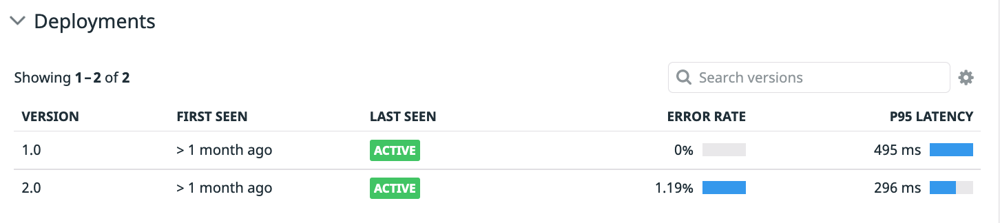

Our Ecommerce logo is the Spree standard one:


We are going to apply a second deployment for the `frontend` service, that uses a different docker image label, that changes the default logo, so we can distinguish them easily.

Open the file called `manifest-files/ingress/ecommerce-v2/frontend.yaml`{{open}} and try to spot the differences with the original one. You can spot the differences running the following `diff` command: `diff -u manifest-files/ecommerce-v1/frontend.yaml  manifest-files/ingress/ecommerce-v2/frontend.yaml`{{execute}}

As you can see we have modified the image tag and the value for the `DD_VERSION` environment variable, to make sure we can track correctly both versions in Datadog. Also, you can see that this second deployment will change the labels slightly, because we will also create a second different Kubernetes service for this one.

Open the file called `manifest-files/ingress/ecommerce-v2/frontend-svc.yaml`{{open}} and try to spot the differences with the first frontend service. You can spot the differences running the following `diff` command: `diff -u manifest-files/ecommerce-v1/frontend-svc.yaml  manifest-files/ingress/ecommerce-v2/frontend-svc.yaml`{{execute}}

As you can see, the only difference is that this second service selects the pods with the label `service:frontendv2`, which is the label we had changed for this second deployment.

Let's apply the second deployment and the second service: `kubectl apply -f manifest-files/ingress/ecommerce-v2/frontend.yaml && kubectl apply -f manifest-files/ingress/ecommerce-v2/frontend-svc.yaml`{{execute}}

We have now two different deployments for `frontend` with a different set of labels, running different docker images: `kubectl get deployments -n ns1  --show-labels | grep frontend`{{execute}}.

Click again on the "Service Ingress" tab and refresh several times the page. As you can see, you still only see version 1.0 for the `frontend` service. The reason is that we haven't added an Ingress object for the second service. Let's do that now.

We are going to create a second Ingress object for our canary service. Open the file called `manifest-files/ingress/ecommerce-v2/ingressv2.yaml`{{open}} and try to spot the differences with the first frontend Ingress object. You can spot the differences running the following `diff` command: `diff -u manifest-files/ingress/ingressv1.yaml  manifest-files/ingress/ecommerce-v2/ingressv2.yaml`{{execute}}

You can see that apart from the  NGINX canary annotations, we are creating this second Ingress object in the `ns2` namespace, and, therefore, it will reference the `frontend` service in that namespace:

```
-  name: frontend-ingress
-  namespace: ns1
+  name: frontend-ingress
+  namespace: ns2
   annotations:
     nginx.ingress.kubernetes.io/rewrite-target: /
+    nginx.ingress.kubernetes.io/canary: "true"
+    nginx.ingress.kubernetes.io/canary-weight: "50"
```

Let's apply that new Ingress object: `kubectl apply -f manifest-files/ingress/ecommerce-v2/ingressv2.yaml`{{execute}}

Refresh several times again the page for the `Ingress Service`. You will see that sometimes you are getting the old logo and sometimes you are getting the new one:


Let's navigate to the [Frontend Service Overview page](https://app.datadoghq.com/apm/service/store-frontend) in Datadog. Datadog is now tracking two different versions of the `store-frontend` service:



Click on the `2.0` row and you will get a comparison between the two versions:



Are we getting new errors? Is the latency of the two versions similar? Are we happy with progressively moving this release forward or shall we rollback?

If you wait long enough, you will see that this second version has a slightly higher error rate and it might be safer to rollback. You can get also this information in the `frontend` service overview page:



**IMPORTANT**: Before continuing, let's revert the second version of the `frontend` service to make sure the rest of the labs work correctly: `kubectl delete -f manifest-files/ingress/ecommerce-v2/`{{execute}}
