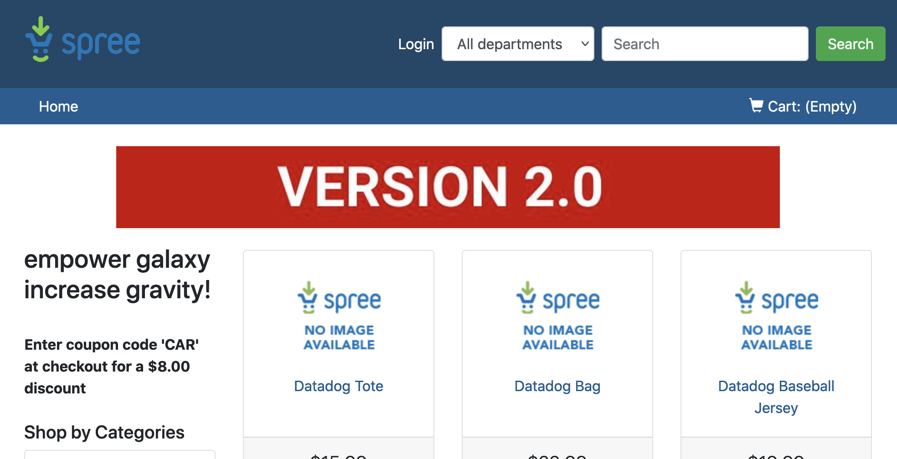

We are going to deploy version 2.0 for the `advertisements` service, but this time we are going to using an Ingress object to move some of the traffic to this second version.

As this is not the service that the Ingress object calls, but rather a service that the `frontend` service calls, we are going to duplicate our application in a second namespace.

Open the folder called `manifest-files/ingress_ns/ecommerce-v2`{{open}} and browse around. You can see the differences between the manifests in this folder and the one in `ecommerce-v1` by running this command: `diff -u manifest-files/ecommerce-v1 manifest-files/ingress_ns/ecommerce-v2`{{execute}}

As you can see, the only differences are that: we are creating the services and deployments in the `ns2` namespace; we have changed the NodePort for the `frontend` service to avoid clashes, and we are using the `2.0` label for the `advertisements` docker image (similar to what we did in the labs about Service Networking).

Let's apply the complete folder: `kubectl apply -f manifest-files/ingress_ns/ecommerce-v2/`{{execute}}

We have now our application replicated in namespace `ns2`. Let's check it: `kubectl get deploy -n ns2 && kubectl get svc -n ns2`{{execute}} You should get an output similar to this one:

```
NAME             READY   UP-TO-DATE   AVAILABLE   AGE
advertisements   1/1     1            1           75m
discounts        1/1     1            1           75m
frontend         1/1     1            1           75m
NAME             TYPE        CLUSTER-IP      EXTERNAL-IP   PORT(S)        AGE
advertisements   ClusterIP   10.104.77.49    <none>        5002/TCP       75m
discounts        ClusterIP   10.102.145.2    <none>        5001/TCP       75m
frontend         NodePort    10.108.72.123   <none>        80:30002/TCP   74m
```

Click again on the "Service Ingress" tab and refresh several times the page. As you can see, you still only see version 1.0 for the `advertisements` service. The reason is that we haven't added an Ingress object for the `frontend` service in the `ns2` namespace. Let's do that now.

We are going to create a second Ingress object for our canary service. Open the file called `manifest-files/ingress_ns/ingressv2.yaml`{{open}} and try to spot the differences with the first frontend Ingress object. You can spot the differences running the following `diff` command: `diff -u manifest-files/ingress/ingressv1.yaml  manifest-files/ingress_ns/ingressv2.yaml`{{execute}}

```
-  name: frontend-ingress
-  namespace: ns1
+  name: frontend-ingress
+  namespace: ns2
   annotations:
     nginx.ingress.kubernetes.io/rewrite-target: /
+    nginx.ingress.kubernetes.io/canary: "true"
+    nginx.ingress.kubernetes.io/canary-weight: "50"
```

You see that the second Ingress gets deployed in the namespace `ns2`, alongside the second version of our application. Also, this Ingress will be a "canary" of the first one.

Let's apply that object: `kubectl apply -f manifest-files/ingress_ns/ingressv2.yaml`{{execute}}

Click again on the "Service Ingress" tab and refresh several times the page. Sometimes you should get the ads banner "Version 1.0" and sometimes you will get the one with "Version 2.0":



**IMPORTANT**: Before continuing, let's remove the first and the second version of the application to make sure the rest of the scenario works correctly: `kubectl delete ns ns1 && kubectl delete ns ns2`{{execute}}
