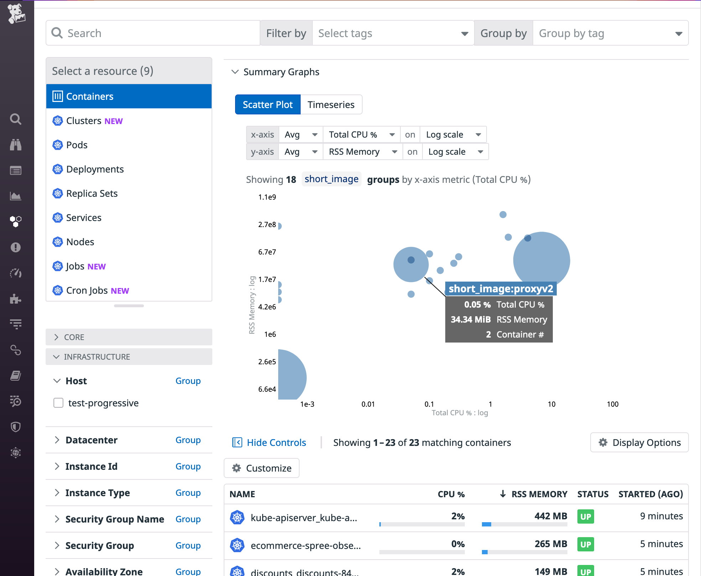
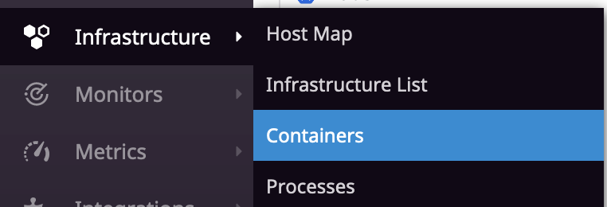
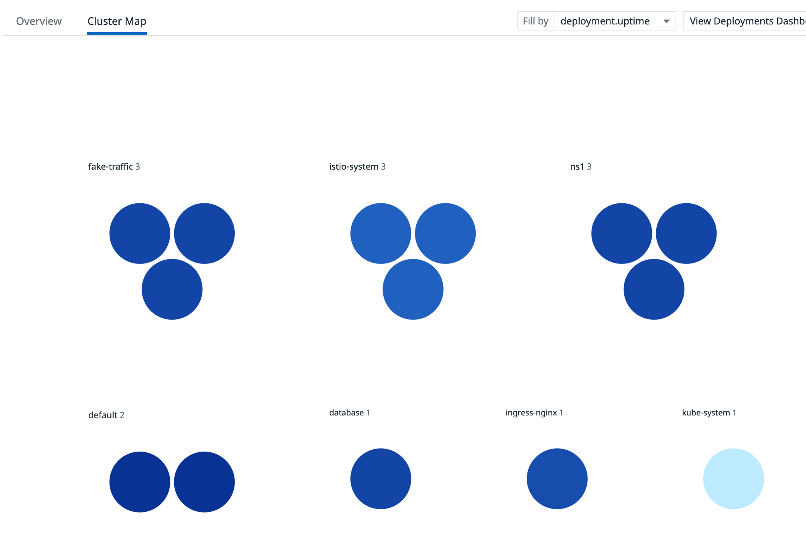
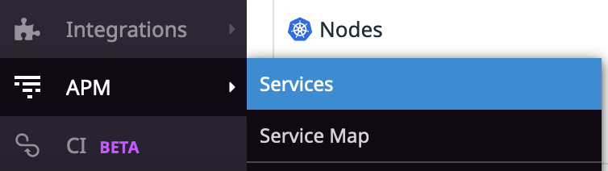
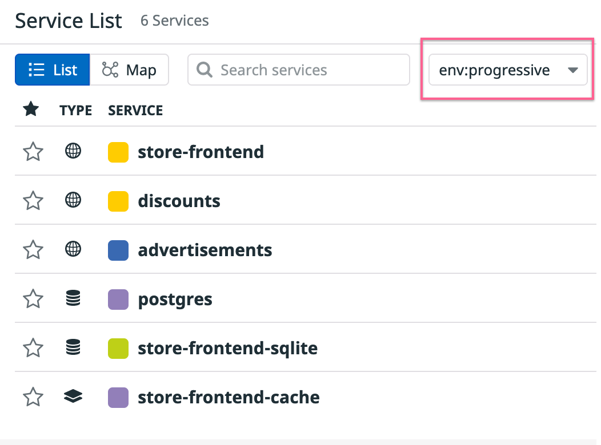
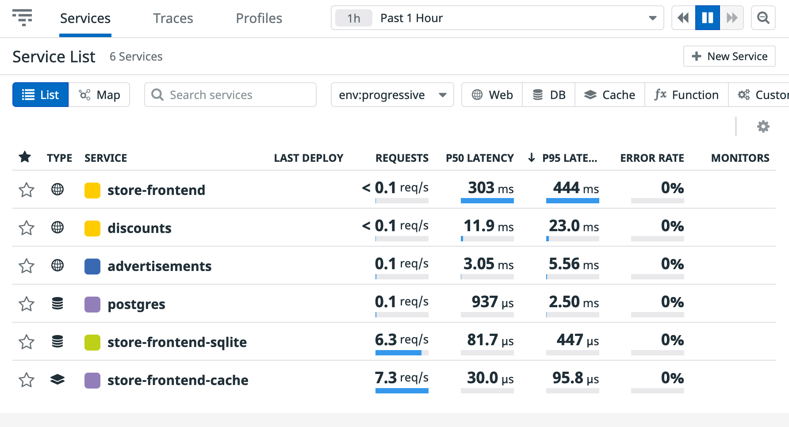
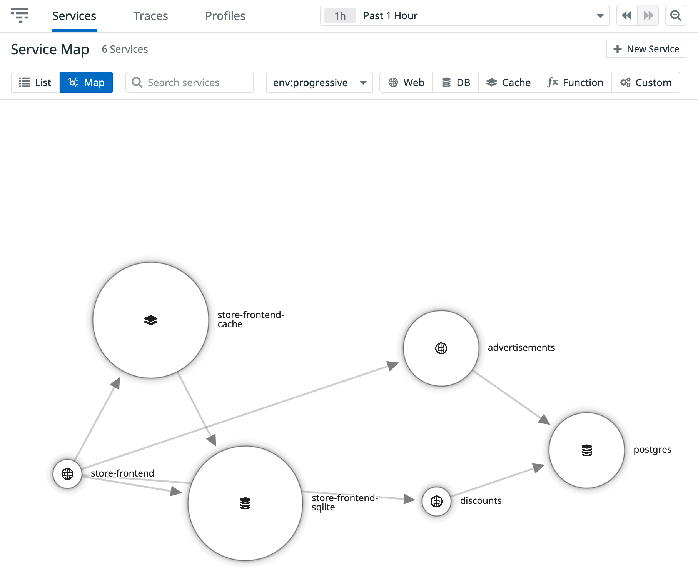

As we have our application up and running and we have deployed Datadog to it, we should start seeing data in our Datadog account. Let's browse around.

## Live Containers

Open the [Live Containers page](https://app.datadoghq.com/containers) and browse around. Take into account that it may take some minutes:

You can also access the Live Containers page navigating the menu: Infrastructure -> Containers:

In the Live Containers page you can have all the information about your Kubernetes cluster in a single place. For example, if you wanted to have a visualization of all Deployments in your cluster, grouped by namespace, you could click on "Deployments", then group by `kube_namespace` and then click on "Cluster Map". [This link](https://app.datadoghq.com/orchestration/map/deployment?groups=kube_namespace&metric=deployment.uptime&paused=false) will send you directly to that visualization:

Continue to browse around the Live Containers page. What other information are you finding?

## Service page

Our application is already instrumented for distributed tracing, so any request made to the application will generate a trace and a set of spans. We are also generating fake traffic to the application, to ensure we get enough data.

Open the [Services list](https://app.datadoghq.com/apm/services?env=progressive). You can also reach the Services list navigating the menu: APM -> Services:

Note: Services at Datadog are organized by environments. If you don't see any services yet, make sure that you are in the right environment. The environment for this workshop is called `progressive` (If you don't see the environment dropdown, then your only account only has one environment, so you should be good):

What services do you see? What type of information are we getting for each of those?

Click now on "Service Map", you can get the same information but in a visual way, being able to quickly understand what services talk to what services in our application:

Hover over the different services to visualize traffic and latency.
