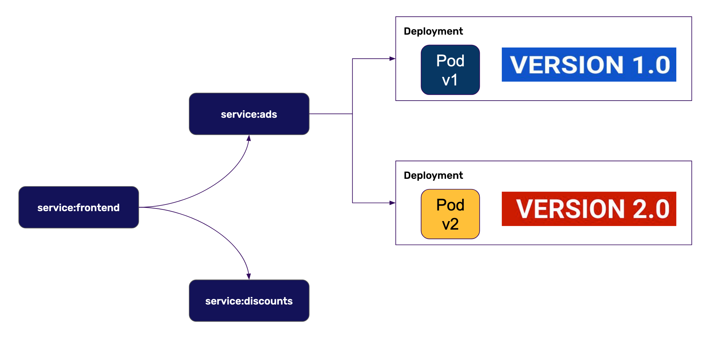

Progressive Delivery is a term that tries to consolidate several deployment practices, including A/B testing, canary deployments, blue/green deployments and feature flags.

In this scenario we will implement Progressive Delivery in Kubernetes in the simplest way: using Kubernetes core service networking. We will:

* Browse the advertisements service overview page
* Create a second deployment for the ads service using version 2.0 of the docker image
* Check that the application sometimes gets the ads that serves version 1.0 of the service, and sometimes it gets version 2.0
* Compare both versions of the ads service in Datadog and make a decision based on it

