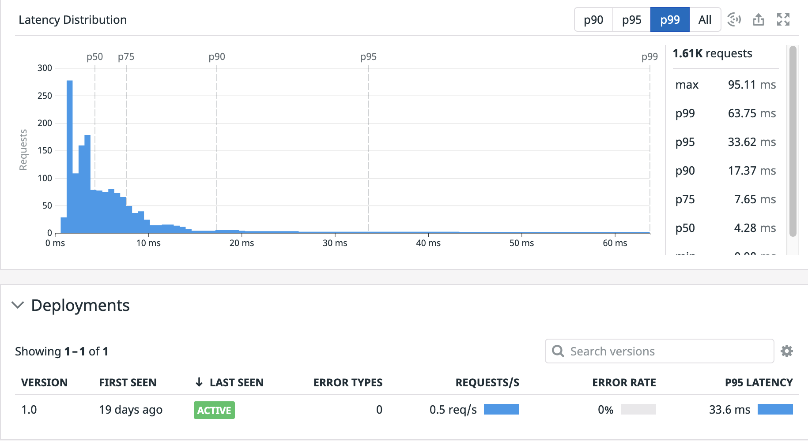

Wait some minutes until your environment is setup. Once it is setup, you will see the following message in your terminal:`OK, the training environment is installed and ready to go.`

To not use your production environment, remember that we have created a new Datadog account for you. You should see your credentials in the terminal:

```
A Datadog account has been created for you.
You can login at http://app.datadoghq.com using
the following credentials:

Username:       <username>
Password:       <password>

Use these credentials to login at http://app.datadoghq.com
This account will expire in 4 days..
A new account will be created at that time.
```

You can always retrieve again these credentials by running this command: `creds`{{execute}}.

For this first progressive delivery scenario, we are going to use the power of service networking and labels in Kubernetes to do a canary deployment of our `advertisements` service.

Open the original file that we used to deploy version `1.0` of the `advertisements` service `manifest-files/ecommerce-v1/advertisements.yaml`{{open}} and check that the image name points to tag `1.0` of the image, and that `DD_VERSION` environment variable is set to `1.0`.

```
[...]
      - image: arapulido/ads-service:1.0
[...]
          - name: DD_VERSION
            value: "1.0"
[...]
```

`DD_ENV`, `DD_SERVICE`, and `DD_VERSION` are part of [Datadog's Unified Service Tagging](https://docs.datadoghq.com/getting_started/tagging/unified_service_tagging/?tab=kubernetes) that allows to correctly correlate metrics, logs and traces for your application different services, taking into account the different environments you may have (production, staging, etc.) and the different versions of your services that you may be running.

Let's check [the `advertisements` service page](https://app.datadoghq.com/apm/service/advertisements/?env=progressive) in Datadog. You can also get to this page through the Datadog menu: APM -> Services, and then selecting the `advertisements` service from the list.

That page is the entry point to get information about a particular service: latency distributions, errors, number of requests, etc. Thanks to the `DD_VERSION` tag that we are sending, we can also get the different versions of the service we have deployed in our cluster:



You can see that currently only version `1.0` is running in our cluster. We will deploy a new version in our next step.
