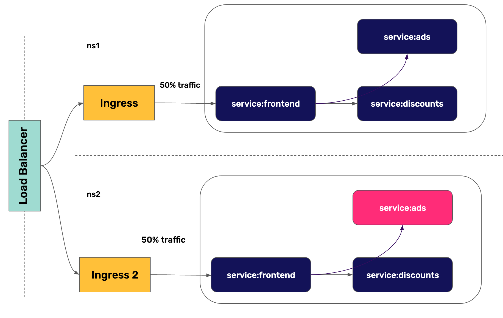

In this scenario we will implement Progressive Delivery in Kubernetes using the Ingress object.

First, we will split the traffic in the same namespace:

* Create an Ingress object for the frontend service
* Create a second deployment for the frontend service with a new logo and a canary Ingress object for it
* Check that the page sometimes returns the old logo, and sometimes the new one
* Compare the two versions in Datadog

Then, we will use the 2 namespaces trick that we saw in the previous section to do a canary deployment for a backend service. We will:

* Create a second deployment for the whole application in a second namespace with ads version 2.0
* Create a canary Ingress object in the second namespace
* Check that the page sometimes returns the Version 1.0 and sometimes the Version 2.0

