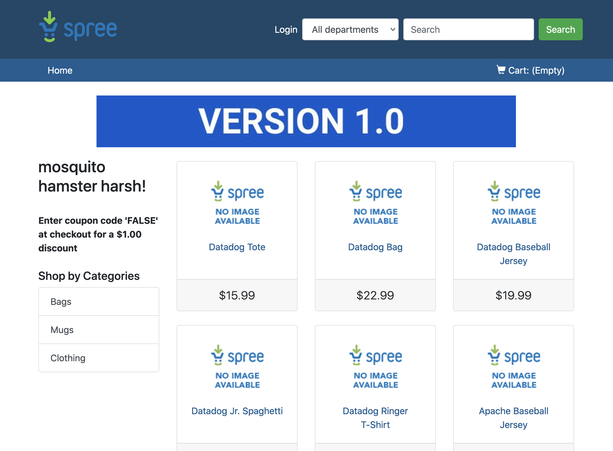

Wait some minutes until your environment is setup. Once it is setup, you will see the following message in your terminal:`OK, the training environment is installed and ready to go.`

We will be using NGINX as our Ingress Controller. This is already running for you in your cluster. Check that the NGINX Ingress Controller is running correctly by executing this command: `kubectl get pods -n ingress-nginx -l app.kubernetes.io/component=controller`{{execute}} You should get an output similar to this one:

```
NAME                                       READY   STATUS    RESTARTS   AGE
ingress-nginx-controller-6c6f5c766-cngvv   1/1     Running   0          29m
```

Clicking on the "Ingress Service" tab will open the NodePort for the Ingress service. Click on that tab. As we don't have yet any Ingress objects created you should get a webpage similar to this:


We are going to create a first Ingress object to redirect all traffic, regardless of the host, to our `frontend` service in the `ns1` namespace. Open the file called `manifest-files/ingress/ingressv1.yaml`{{open}} As you can see, for all paths with a prefix of `/` (basically, any path) will be redirected to the `frontend` service.

```
[...]
  - http:
      paths:
      - path: /
        pathType: Prefix
        backend:
          service:
            name: frontend
            port:
              number: 80
[...]
```

Let's apply that new Ingress object: `kubectl apply -f manifest-files/ingress/ingressv1.yaml`{{execute}}

Once the Ingress object has been created, refresh the NGINX page and you should get now the Ecommerce application:



We are now accessing our website through Ingress!
