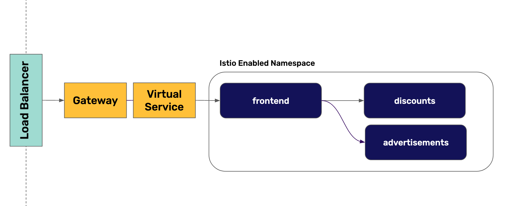
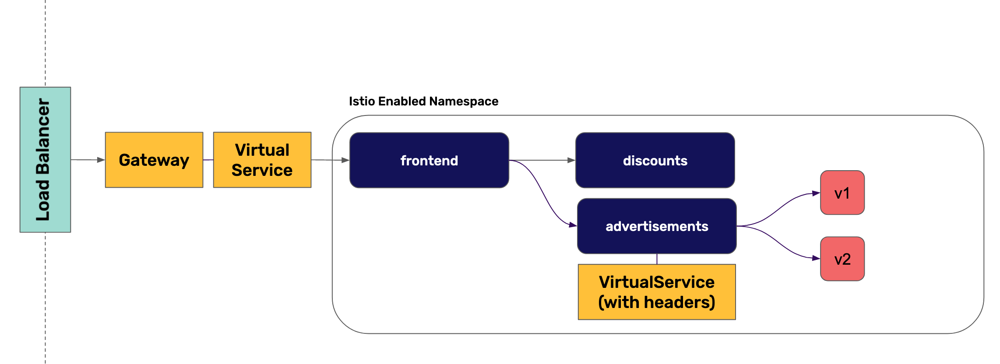

In this scenario we will implement progressive delivery in Kubernetes using Istio for it.

First, we will expose our service through the Istio Gateway and VirtualService objects. We will:
* Create a new Ecommerce deployment in an Istio enabled namespace
* Create a Gateway and VirtualService to access the Frontend service

Then, we will use Istio to create a progressive delivery of the advertisements service based on HTTP headers. We will:
* Create a second deployment for advertisements with version 2.0 of the container
* Create a DestinationRules object to tell Istio about the two versions
* Create a VirtualService for advertisements to canary version 2.0

